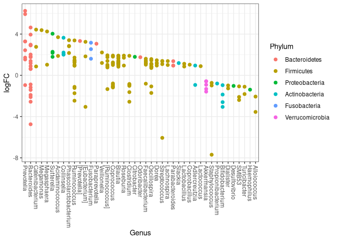

```r
library(HMP2Data)
library(phyloseq)
library(dplyr)
library(stringr)
library(DESeq2)
library(edgeR)
library(eulerr)
library(pheatmap)
library(ggplot2)
library(ggrepel)
```

Repetimos los mismos pasos de _wrangling_.


```r
T2D = T2D16S()
T2D_otu = otu_table(T2D) %>% as.data.frame()
T2D_samples = sample_data(T2D) %>% as.data.frame()
T2D_tax = tax_table(T2D)
T2D_gut_IDs = subset(rownames(T2D_samples), T2D_samples$sample_body_site == "feces")
T2D_otu_gut = select(T2D_otu, T2D_gut_IDs)
```

```
## Note: Using an external vector in selections is ambiguous.
## ℹ Use `all_of(T2D_gut_IDs)` instead of `T2D_gut_IDs` to silence this message.
## ℹ See <https://tidyselect.r-lib.org/reference/faq-external-vector.html>.
## This message is displayed once per session.
```

```r
IDs_no_tail = str_sub(T2D_gut_IDs, 1, -7)
IDs_no_tailhead = str_sub(IDs_no_tail,29,-1)

head(as.data.frame(T2D_gut_IDs))
```

```
##                                      T2D_gut_IDs
## 1   HMP2_J00825_1_ST_T0_B0_0120_ZN9YTFN-01_AA31J
## 2 HMP2_J00826_1_ST_T0_B0_0120_ZN9YTFN-1011_AA31J
## 3 HMP2_J00827_1_ST_T0_B0_0120_ZN9YTFN-1012_AA31J
## 4 HMP2_J00828_1_ST_T0_B0_0120_ZN9YTFN-1013_AA31J
## 5 HMP2_J00829_1_ST_T0_B0_0120_ZN9YTFN-1014_AA31J
## 6 HMP2_J00830_1_ST_T0_B0_0120_ZN9YTFN-1015_AA31J
```

```r
head(as.data.frame(IDs_no_tail))
```

```
##                                IDs_no_tail
## 1   HMP2_J00825_1_ST_T0_B0_0120_ZN9YTFN-01
## 2 HMP2_J00826_1_ST_T0_B0_0120_ZN9YTFN-1011
## 3 HMP2_J00827_1_ST_T0_B0_0120_ZN9YTFN-1012
## 4 HMP2_J00828_1_ST_T0_B0_0120_ZN9YTFN-1013
## 5 HMP2_J00829_1_ST_T0_B0_0120_ZN9YTFN-1014
## 6 HMP2_J00830_1_ST_T0_B0_0120_ZN9YTFN-1015
```

```r
head(as.data.frame(IDs_no_tailhead))
```

```
##   IDs_no_tailhead
## 1      ZN9YTFN-01
## 2    ZN9YTFN-1011
## 3    ZN9YTFN-1012
## 4    ZN9YTFN-1013
## 5    ZN9YTFN-1014
## 6    ZN9YTFN-1015
```

```r
OTUs_clinical = T2D_otu_gut
colnames(OTUs_clinical) <- NULL
colnames(OTUs_clinical) <- IDs_no_tailhead

df_clinico = read.csv("clinical_data", sep = "\t")

salud = filter(df_clinico, df_clinico$CL4 == "Healthy")
infeccion = filter(df_clinico, 
                   df_clinico$CL4 == "Infection" | df_clinico$CL4 == "Infection_L")


OTUs_clinical_unique = OTUs_clinical[!duplicated(names(OTUs_clinical))]
OTUs_clinical_IDs = colnames(OTUs_clinical_unique)


salud_IDs = salud$VisitID
salud_IDs_flt = subset(salud_IDs, salud_IDs %in% OTUs_clinical_IDs)


infeccion_IDs = infeccion$VisitID
infeccion_IDs_flt = subset(infeccion_IDs, infeccion_IDs %in% OTUs_clinical_IDs)

#Obtenemos la matriz de OTUs que contiene ambas condiciones anotadas

OTUs_clinical_salud_flt = select(OTUs_clinical_unique, salud_IDs_flt)
```

```
## Note: Using an external vector in selections is ambiguous.
## ℹ Use `all_of(salud_IDs_flt)` instead of `salud_IDs_flt` to silence this message.
## ℹ See <https://tidyselect.r-lib.org/reference/faq-external-vector.html>.
## This message is displayed once per session.
```

```r
OTUs_clinical_infeccion_flt = select(OTUs_clinical_unique, infeccion_IDs_flt)
```

```
## Note: Using an external vector in selections is ambiguous.
## ℹ Use `all_of(infeccion_IDs_flt)` instead of `infeccion_IDs_flt` to silence this message.
## ℹ See <https://tidyselect.r-lib.org/reference/faq-external-vector.html>.
## This message is displayed once per session.
```

```r
OTUs_clinical_complete = cbind(OTUs_clinical_salud_flt, OTUs_clinical_infeccion_flt)
OTUs_clinical_complete_nonzero = OTUs_clinical_complete + 1


coldata_salud = cbind(salud_IDs_flt, rep("Saludable", length(salud_IDs_flt))) %>% as.data.frame()
coldata_infeccion = cbind(infeccion_IDs_flt, rep("Infectados", length(infeccion_IDs_flt))) %>% as.data.frame()

colnames(coldata_salud) = c("Visit_ID","condition")
colnames(coldata_infeccion) = c("Visit_ID","condition")

#unimos los dos dfs.

coldata = rbind(coldata_salud, coldata_infeccion)
coldata$condition = factor(coldata$condition)
```

## Creando el objeto de Phyloseq

El siguiente objetivo es crear un objeto de phyloseq que contenga la información de la tabla de taxonomías que le corresponden a cada OTU, al igual que la nueva tabla de metadatos que le corresponen a cada muestra. Para crear el objeto de phyloseq, necesitamos lo siguiente.

- Tabla de OTUs como matriz.
- Tabla de metadatos de las muestras como data frame
- Tabla de taxonomia de los OTUs como matriz


```r
#OTUs como matriz
OTUs_clinical_complete = as.matrix(OTUs_clinical_complete)

#sample data como DF
coldata_mod = coldata[,-1] %>% as.data.frame()
rownames(coldata_mod) = coldata[,1]
colnames(coldata_mod) = "condition"

#Tabla de taxonomia como matriz ya la tenemos en el objeto original T2D

#Creamos objeto phyloseq desginando las matrices como componenten del objeto phyloseq
OTU = otu_table(OTUs_clinical_complete, taxa_are_rows = TRUE)
samp = sample_data(coldata_mod)


T2D_phseq = phyloseq(OTU, T2D_tax, samp)
T2D_phseq
```

```
## phyloseq-class experiment-level object
## otu_table()   OTU Table:         [ 12062 taxa and 445 samples ]
## sample_data() Sample Data:       [ 445 samples by 1 sample variables ]
## tax_table()   Taxonomy Table:    [ 12062 taxa by 7 taxonomic ranks ]
```


## Expresión diferencial con edgeR

Definimos la funcion que convierte los objetos de Phyloseq a DGE de edgeR


```r
phyloseq_to_edgeR = function(physeq, group, method="TMM", ...){
  require("edgeR")
  require("phyloseq")
  # Enforce orientation.
  if( !taxa_are_rows(physeq) ){ physeq <- t(physeq) }
  x = as(otu_table(physeq), "matrix")
  # Add one to protect against overflow, log(0) issues.
  x = x + 1
  # Check `group` argument
  if( identical(all.equal(length(group), 1), TRUE) & nsamples(physeq) > 1 ){
    # Assume that group was a sample variable name (must be categorical)
    group = get_variable(physeq, group)
  }
  # Define gene annotations (`genes`) as tax_table
  taxonomy = tax_table(physeq, errorIfNULL=FALSE)
  if( !is.null(taxonomy) ){
    taxonomy = data.frame(as(taxonomy, "matrix"))
  } 
  # Now turn into a DGEList
  y = DGEList(counts=x, group=group, genes=taxonomy, remove.zeros = TRUE, ...)
  # Calculate the normalization factors
  z = calcNormFactors(y, method=method)
  # Check for division by zero inside `calcNormFactors`
  if( !all(is.finite(z$samples$norm.factors)) ){
    stop("Something wrong with edgeR::calcNormFactors on this data,
         non-finite $norm.factors, consider changing `method` argument")
  }
  # Estimate dispersions
  return(estimateTagwiseDisp(estimateCommonDisp(z)))
}
```


```r
dge = phyloseq_to_edgeR(T2D_phseq, group="condition")
# Perform binary test
et = exactTest(dge)
summary(decideTestsDGE(et, p.value = 0.01))
```

```
##        Saludable-Infectados
## Down                    164
## NotSig                11597
## Up                      301
```

```r
# Extract values from test results
tt = topTags(et, n=nrow(dge$table), adjust.method="BH", sort.by="PValue")
res = tt@.Data[[1]]
alpha = 0.001
sigtab = res[(res$FDR < alpha), ]
sigtab = cbind(as(sigtab, "data.frame"), as(tax_table(T2D_phseq)[rownames(sigtab), ], "matrix"))
dim(sigtab)
```

```
## [1] 352  18
```

```r
head(sigtab)
```

```
##          Kingdom         Phylum           Class              Order
## 1101177 Bacteria     Firmicutes         Bacilli         Bacillales
## 967427  Bacteria     Firmicutes         Bacilli    Lactobacillales
## 103730  Bacteria  Bacteroidetes     Bacteroidia      Bacteroidales
## 1033167 Bacteria     Firmicutes         Bacilli    Lactobacillales
## 69933   Bacteria Actinobacteria  Actinobacteria  Bifidobacteriales
## 1131759 Bacteria     Firmicutes Erysipelotrichi Erysipelotrichales
##                      Family           Genus Species     logFC    logCPM
## 1101177   Staphylococcaceae  Staphylococcus  aureus -7.694882 11.141882
## 967427     Streptococcaceae   Streptococcus    <NA> -6.062318  9.274081
## 103730       Bacteroidaceae     Bacteroides    <NA> -4.743882  8.249478
## 1033167       Aerococcaceae    Alloiococcus    <NA> -3.547742  7.436581
## 69933    Bifidobacteriaceae Bifidobacterium    <NA> -3.059952  7.260186
## 1131759 Erysipelotrichaceae   [Eubacterium]    <NA> -3.056480  7.490000
##                PValue           FDR  Kingdom         Phylum           Class
## 1101177 3.491757e-198 4.211757e-194 Bacteria     Firmicutes         Bacilli
## 967427  1.181680e-172 7.126710e-169 Bacteria     Firmicutes         Bacilli
## 103730  7.613311e-129 3.061059e-125 Bacteria  Bacteroidetes     Bacteroidia
## 1033167  6.545928e-90  1.973925e-86 Bacteria     Firmicutes         Bacilli
## 69933    3.751193e-70  9.049377e-67 Bacteria Actinobacteria  Actinobacteria
## 1131759  2.233236e-63  4.489549e-60 Bacteria     Firmicutes Erysipelotrichi
##                      Order              Family           Genus Species
## 1101177         Bacillales   Staphylococcaceae  Staphylococcus  aureus
## 967427     Lactobacillales    Streptococcaceae   Streptococcus    <NA>
## 103730       Bacteroidales      Bacteroidaceae     Bacteroides    <NA>
## 1033167    Lactobacillales       Aerococcaceae    Alloiococcus    <NA>
## 69933    Bifidobacteriales  Bifidobacteriaceae Bifidobacterium    <NA>
## 1131759 Erysipelotrichales Erysipelotrichaceae   [Eubacterium]    <NA>
```


```r
theme_set(theme_bw())
scale_fill_discrete <- function(palname = "Set1", ...) {
    scale_fill_brewer(palette = palname, ...)
}
sigtabgen = subset(sigtab, !is.na(Genus))
# Phylum order
x = tapply(sigtabgen$logFC, sigtabgen$Phylum, function(x) max(x))
x = sort(x, TRUE)
sigtabgen$Phylum = factor(as.character(sigtabgen$Phylum), levels = names(x))
# Genus order
x = tapply(sigtabgen$logFC, sigtabgen$Genus, function(x) max(x))
x = sort(x, TRUE)
sigtabgen$Genus = factor(as.character(sigtabgen$Genus), levels = names(x))
ggplot(sigtabgen, aes(x = Genus, y = logFC, color = Phylum)) + geom_point(size=2) + 
  theme(axis.text.x = element_text(angle = -90, hjust = 0, vjust = 0.5))
```

<!-- -->


Visualizamos resultados con volcano plot.


```r
#Primero categorizamos si los OTUS se encuentran UP o DOWN
volcano_plot = function(edgeR_DEgenes, logfc, pvalue){

  edgeR_DEgenestax = edgeR_DEgenes$genes
  edgeR_DEgenesTable=edgeR_DEgenes$table
edgeR_DEgenesTable$p.adj = p.adjust(edgeR_DEgenesTable$PValue, "fdr")
edgeR_DEgenesTable$DA = "NS"
edgeR_DEgenesTable$DA[edgeR_DEgenesTable$logFC >(logfc) & edgeR_DEgenesTable$p.adj <(pvalue)] = "UP"
edgeR_DEgenesTable$DA[edgeR_DEgenesTable$logFC < -(logfc) & edgeR_DEgenesTable$p.adj <(pvalue)] = "DOWN"
edgeR_DEgenesTable$DA = as.factor(edgeR_DEgenesTable$DA)
edgeR_DEgenesTable$delabel <- NA
edgeR_DEgenesTable$delabel[edgeR_DEgenesTable$DA != "NS"] <- edgeR_DEgenestax$Phylum[edgeR_DEgenesTable$DA != "NS"]


p <- ggplot(data=edgeR_DEgenesTable, aes(x=logFC, y=-log10(p.adj), col=DA, label=delabel)) + geom_point(size= 1) + theme_minimal() + geom_text_repel()

p2 = p + geom_vline(xintercept=c(-logfc, logfc), col="red") +
        geom_hline(yintercept=-log10(pvalue), col="red")

mycolors <- c("lightgreen", "coral", "darkgray")
names(mycolors) <- c("DOWN", "UP", "NS")
p3 <- p2 + scale_colour_manual(values = mycolors)
p3 = p2 + scale_color_manual(values=mycolors) + ylim(0,75)
return(p3)
}
```


```r
options(ggrepel.max.overlaps = 25)
volcano_plot(et,1,0.001)
```

```
## Warning: Removed 4 rows containing missing values (geom_point).
```

```
## Warning: Removed 11794 rows containing missing values (geom_text_repel).
```

```
## Warning: ggrepel: 240 unlabeled data points (too many overlaps). Consider
## increasing max.overlaps
```

<!-- -->

