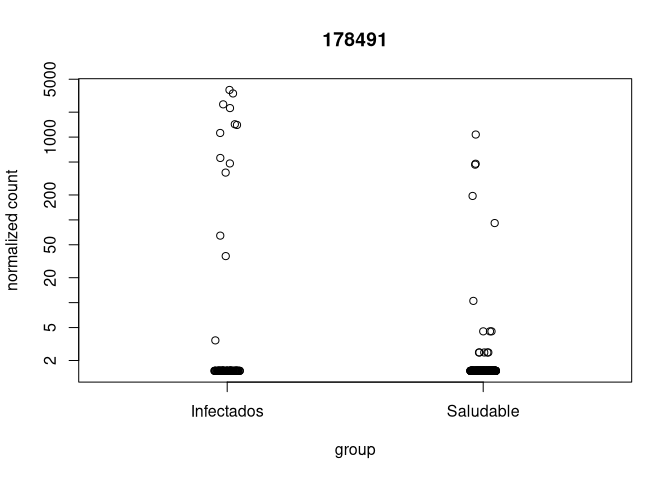
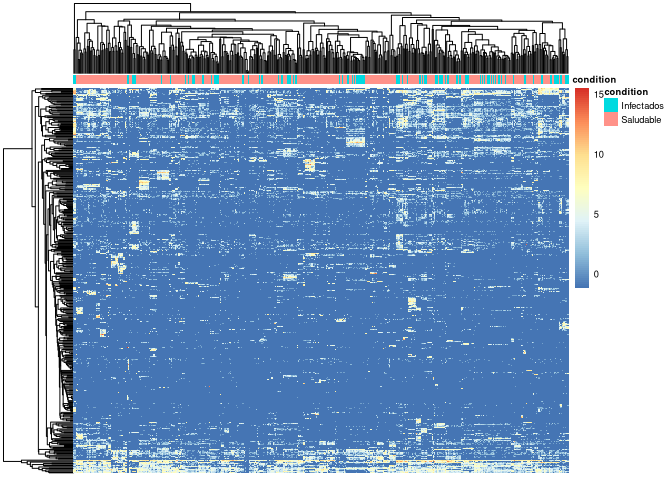
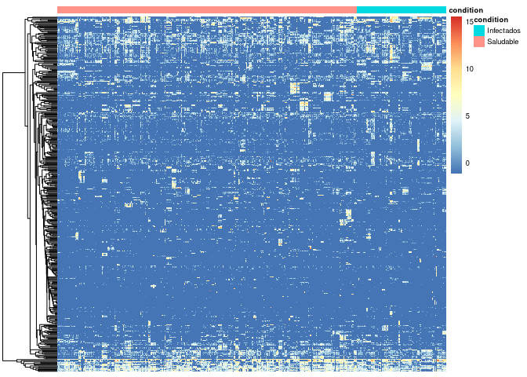
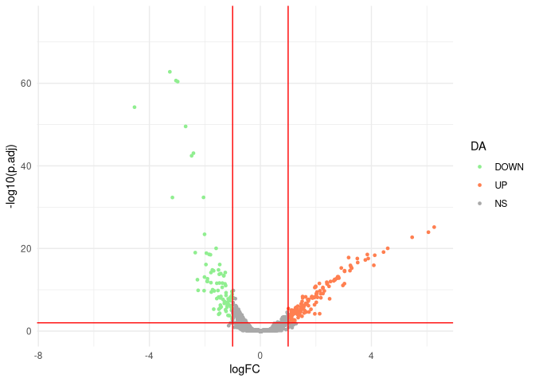

```r
library(HMP2Data)
library(phyloseq)
library(dplyr)
library(stringr)
library(DESeq2)
library(edgeR)
library(eulerr)
library(pheatmap)
library(ggplot2)
```


```r
T2D = T2D16S()
T2D_otu = otu_table(T2D) %>% as.data.frame()
T2D_samples = sample_data(T2D) %>% as.data.frame()
T2D_gut_IDs = subset(rownames(T2D_samples), T2D_samples$sample_body_site == "feces")
T2D_otu_gut = select(T2D_otu, T2D_gut_IDs)
```

```
## Note: Using an external vector in selections is ambiguous.
## ℹ Use `all_of(T2D_gut_IDs)` instead of `T2D_gut_IDs` to silence this message.
## ℹ See <https://tidyselect.r-lib.org/reference/faq-external-vector.html>.
## This message is displayed once per session.
```

```r
IDs_no_tail = str_sub(T2D_gut_IDs, 1, -7)
IDs_no_tailhead = str_sub(IDs_no_tail,29,-1)

head(as.data.frame(T2D_gut_IDs))
```

```
##                                      T2D_gut_IDs
## 1   HMP2_J00825_1_ST_T0_B0_0120_ZN9YTFN-01_AA31J
## 2 HMP2_J00826_1_ST_T0_B0_0120_ZN9YTFN-1011_AA31J
## 3 HMP2_J00827_1_ST_T0_B0_0120_ZN9YTFN-1012_AA31J
## 4 HMP2_J00828_1_ST_T0_B0_0120_ZN9YTFN-1013_AA31J
## 5 HMP2_J00829_1_ST_T0_B0_0120_ZN9YTFN-1014_AA31J
## 6 HMP2_J00830_1_ST_T0_B0_0120_ZN9YTFN-1015_AA31J
```

```r
head(as.data.frame(IDs_no_tail))
```

```
##                                IDs_no_tail
## 1   HMP2_J00825_1_ST_T0_B0_0120_ZN9YTFN-01
## 2 HMP2_J00826_1_ST_T0_B0_0120_ZN9YTFN-1011
## 3 HMP2_J00827_1_ST_T0_B0_0120_ZN9YTFN-1012
## 4 HMP2_J00828_1_ST_T0_B0_0120_ZN9YTFN-1013
## 5 HMP2_J00829_1_ST_T0_B0_0120_ZN9YTFN-1014
## 6 HMP2_J00830_1_ST_T0_B0_0120_ZN9YTFN-1015
```

```r
head(as.data.frame(IDs_no_tailhead))
```

```
##   IDs_no_tailhead
## 1      ZN9YTFN-01
## 2    ZN9YTFN-1011
## 3    ZN9YTFN-1012
## 4    ZN9YTFN-1013
## 5    ZN9YTFN-1014
## 6    ZN9YTFN-1015
```

```r
OTUs_clinical = T2D_otu_gut
colnames(OTUs_clinical) <- NULL
colnames(OTUs_clinical) <- IDs_no_tailhead

df_clinico = read.csv("clinical_data", sep = "\t")

salud = filter(df_clinico, df_clinico$CL4 == "Healthy")
infeccion = filter(df_clinico, 
                   df_clinico$CL4 == "Infection" | df_clinico$CL4 == "Infection_L")


OTUs_clinical_unique = OTUs_clinical[!duplicated(names(OTUs_clinical))]
OTUs_clinical_IDs = colnames(OTUs_clinical_unique)


salud_IDs = salud$VisitID
salud_IDs_flt = subset(salud_IDs, salud_IDs %in% OTUs_clinical_IDs)


infeccion_IDs = infeccion$VisitID
infeccion_IDs_flt = subset(infeccion_IDs, infeccion_IDs %in% OTUs_clinical_IDs)

#Obtenemos la matriz de OTUs que contiene ambas condiciones anotadas

OTUs_clinical_salud_flt = select(OTUs_clinical_unique, salud_IDs_flt)
```

```
## Note: Using an external vector in selections is ambiguous.
## ℹ Use `all_of(salud_IDs_flt)` instead of `salud_IDs_flt` to silence this message.
## ℹ See <https://tidyselect.r-lib.org/reference/faq-external-vector.html>.
## This message is displayed once per session.
```

```r
OTUs_clinical_infeccion_flt = select(OTUs_clinical_unique, infeccion_IDs_flt)
```

```
## Note: Using an external vector in selections is ambiguous.
## ℹ Use `all_of(infeccion_IDs_flt)` instead of `infeccion_IDs_flt` to silence this message.
## ℹ See <https://tidyselect.r-lib.org/reference/faq-external-vector.html>.
## This message is displayed once per session.
```

```r
OTUs_clinical_complete = cbind(OTUs_clinical_salud_flt, OTUs_clinical_infeccion_flt)
OTUs_clinical_complete_nonzero = OTUs_clinical_complete + 1


coldata_salud = cbind(salud_IDs_flt, rep("Saludable", length(salud_IDs_flt))) %>% as.data.frame()
coldata_infeccion = cbind(infeccion_IDs_flt, rep("Infectados", length(infeccion_IDs_flt))) %>% as.data.frame()

colnames(coldata_salud) = c("Visit_ID","condition")
colnames(coldata_infeccion) = c("Visit_ID","condition")

#unimos los dos dfs.

coldata = rbind(coldata_salud, coldata_infeccion)
coldata$condition = factor(coldata$condition)


#Objeto de DESeq
dds=DESeqDataSetFromMatrix(countData = OTUs_clinical_complete_nonzero, 
                           colData = coldata, design = ~ condition) 
```

```
## converting counts to integer mode
```

```r
vst = assay(varianceStabilizingTransformation(dds), blind= TRUE)
```

```
## -- note: fitType='parametric', but the dispersion trend was not well captured by the
##    function: y = a/x + b, and a local regression fit was automatically substituted.
##    specify fitType='local' or 'mean' to avoid this message next time.
```


##Abundancia diferencial con DESeq2.

Buscamos OTUs diferencialmente abundantes con la función DESeq()


```r
DESeq_OTUs = DESeq(dds)
```

```
## estimating size factors
```

```
## estimating dispersions
```

```
## gene-wise dispersion estimates
```

```
## mean-dispersion relationship
```

```
## -- note: fitType='parametric', but the dispersion trend was not well captured by the
##    function: y = a/x + b, and a local regression fit was automatically substituted.
##    specify fitType='local' or 'mean' to avoid this message next time.
```

```
## final dispersion estimates
```

```
## fitting model and testing
```

```
## -- replacing outliers and refitting for 773 genes
## -- DESeq argument 'minReplicatesForReplace' = 7 
## -- original counts are preserved in counts(dds)
```

```
## estimating dispersions
```

```
## fitting model and testing
```

```r
resultado001 = results(DESeq_OTUs, alpha=0.01)
summary(resultado001)
```

```
## 
## out of 12062 with nonzero total read count
## adjusted p-value < 0.01
## LFC > 0 (up)       : 296, 2.5%
## LFC < 0 (down)     : 111, 0.92%
## outliers [1]       : 0, 0%
## low counts [2]     : 9347, 77%
## (mean count < 1)
## [1] see 'cooksCutoff' argument of ?results
## [2] see 'independentFiltering' argument of ?results
```

```r
DESeq2::plotMA(resultado001, ylim=c(-2,2))
```

<!-- -->

```r
plotCounts(DESeq_OTUs, gene = which.min(resultado001$padj), intgroup = "condition")
```

<!-- -->


Podemos usar edgeR de la misma manera.


```r
count_edgeR_obj = DGEList(counts= OTUs_clinical_complete_nonzero, group = coldata$condition)

#Normalización
count_edgeR_obj=estimateCommonDisp(count_edgeR_obj)
count_edgeR_obj=estimateTagwiseDisp(count_edgeR_obj)

#Calculando la expresión diferencial

## EdgeR hace una prueba de fisher exacta, y por default ajusta el valor de P con la prueba de Benjamin Hochberg

edgeR_DEgenes=exactTest(count_edgeR_obj)
summary(decideTestsDGE(edgeR_DEgenes, p.value = 0.01))
```

```
##        Saludable-Infectados
## Down                    180
## NotSig                11667
## Up                      215
```

```r
plotMD(edgeR_DEgenes,p.value = 0.01 )
```

<!-- -->

```r
edgeR_DEgenesTable=edgeR_DEgenes$table
edgeR_DEgenesTable$p.adj = p.adjust(edgeR_DEgenesTable$PValue, "fdr")
```


Podemos comparar si coicidieron ambos metodos. Primero necesitamos extraer los taxones DA de ambas pruebas.


```r
#edgeR
signedgeR_DEgene= filter(edgeR_DEgenesTable, edgeR_DEgenesTable$p.adj < 0.01)
edgeRORD <- signedgeR_DEgene[order(signedgeR_DEgene$PValue),]

#DESeq2
DEGDS <- as.data.frame(resultado001) 
DEGDS <- filter(DEGDS, !is.na(DEGDS$padj))
DEGDS <- filter(DEGDS, DEGDS$padj<0.01)
DEGDS <- DEGDS[order(DEGDS$padj),] #DEGs de DESeq
```


```r
DS <- rownames(DEGDS)
ER <- rownames(edgeRORD)
Euler_list <- list(DeSeq2 = DS,
                   edgeR = ER)
Euler <- euler(Euler_list)


plot(Euler, quantities = TRUE,legend = "", main = "Taxas diferencialmente abundantes", fills=c("lightpink","lightblue"))
```

<!-- -->


```r
DSER = intersect(DS, ER)
DS_and_ER = union(setdiff(DS,ER), setdiff(ER,DS))

vst_DA = filter(as.data.frame(vst), rownames(vst) %in% ER)

coldata_mod = coldata[,-1] %>% as.data.frame()
rownames(coldata_mod) = coldata[,1]
colnames(coldata_mod) = "condition"

#Resultados de ER muestran mejor agrupamiento de las muestras de interés.

#Heatmap con clustering de columnas
pheatmap(vst_DA, fontsize = 7, border_color = NA, annotation_col = coldata_mod, show_rownames = F, show_colnames = F, labels_row = NULL, annotation_legend = T, cluster_cols = T)
```

<!-- -->

```r
#Heatmap sin clustering de columnas
pheatmap(vst_DA, fontsize = 7, border_color = NA, annotation_col = coldata_mod, show_rownames = F, show_colnames = F, labels_row = NULL, annotation_legend = T, cluster_cols = F)
```

<!-- -->


Podemos visualizar los resultados con un gráfico de vólcan.


```r
#Primero categorizamos si los OTUS se encuentran UP o DOWN
edgeR_DEgenesTable$DA = "NS"
edgeR_DEgenesTable$DA[edgeR_DEgenesTable$logFC >1 & edgeR_DEgenesTable$p.adj <0.01] = "UP"
edgeR_DEgenesTable$DA[edgeR_DEgenesTable$logFC < -1 & edgeR_DEgenesTable$p.adj <0.01] = "DOWN"
edgeR_DEgenesTable$DA = as.factor(edgeR_DEgenesTable$DA)

p <- ggplot(data=edgeR_DEgenesTable, aes(x=logFC, y=-log10(p.adj), col=DA)) + geom_point(size= 1) + theme_minimal()

p2 = p + geom_vline(xintercept=c(-1, 1), col="red") +
        geom_hline(yintercept=-log10(0.01), col="red")

mycolors <- c("lightgreen", "coral", "darkgray")
names(mycolors) <- c("DOWN", "UP", "NS")
p3 <- p2 + scale_colour_manual(values = mycolors)
p3 = p2 + scale_color_manual(values=mycolors) + ylim(0,75)
 p3
```

```
## Warning: Removed 4 rows containing missing values (geom_point).
```

<!-- -->


