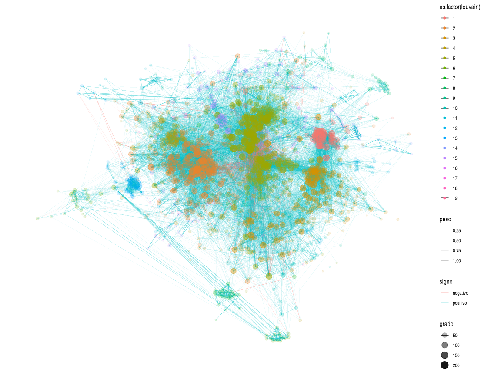
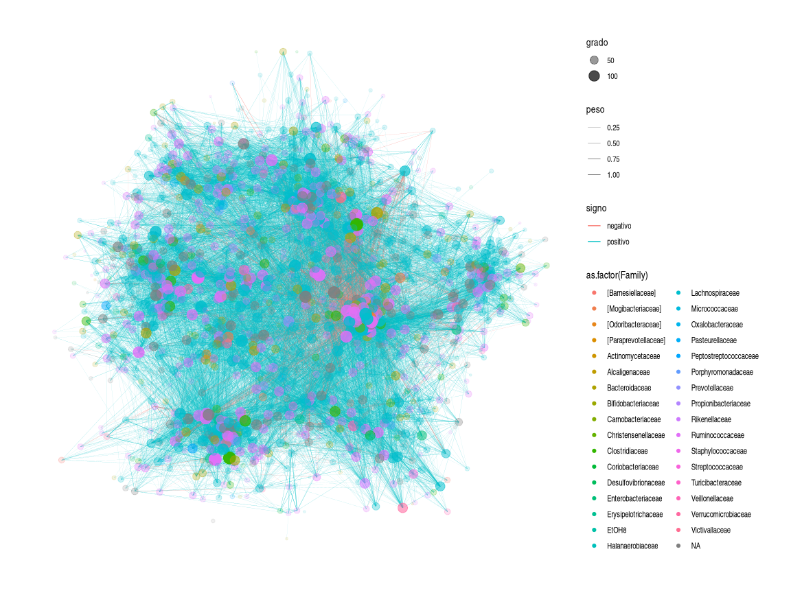
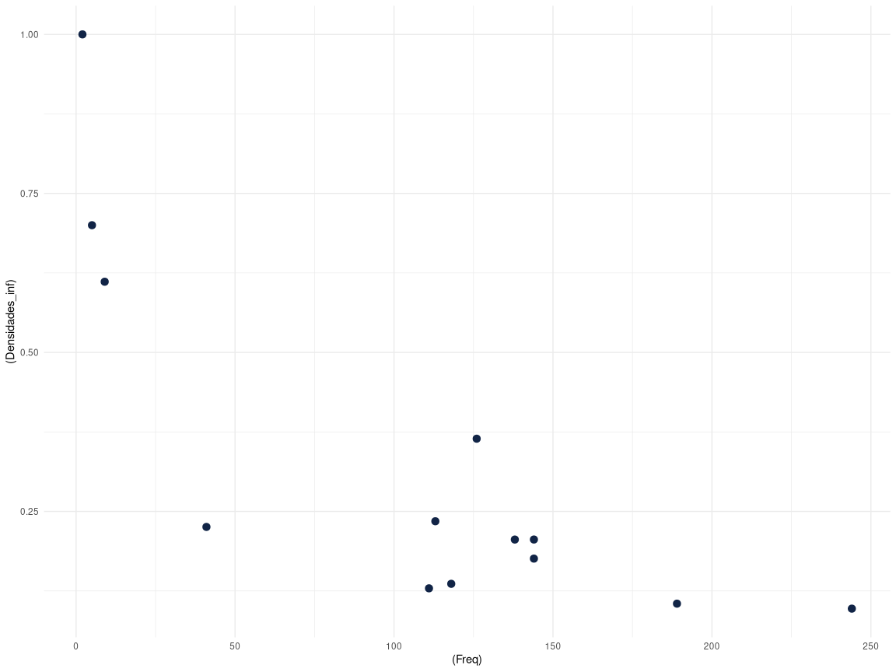
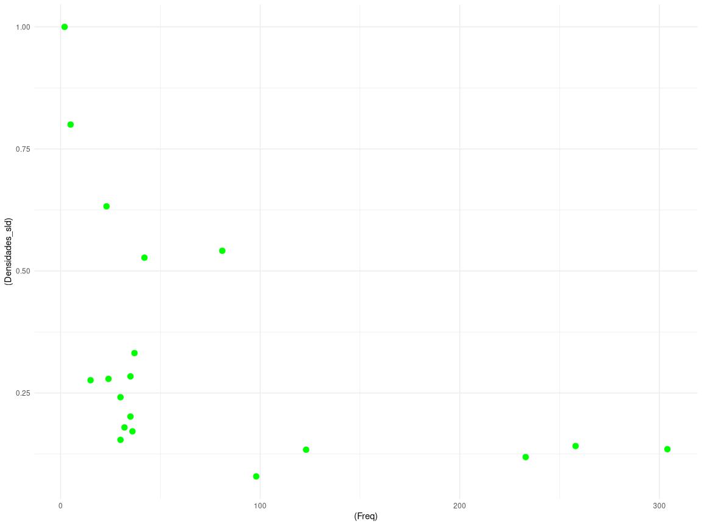

```r
library(vroom)
library(igraph)
library(ggraph)
library(ggplot2)
library(graphlayouts)
library(HMP2Data)
library(phyloseq)
library(dplyr)
library(RColorBrewer)
library(ggforce)
library(pheatmap)
library(janitor)
```


```r
inf = vroom("adj_mat_inf.csv") %>% as.matrix()
inf = inf[,-1]
infn = colnames(inf)

rownames(inf) = infn
diag(inf) = 0


sld = vroom("adj_mat_sld.csv") %>% as.matrix()
sld = sld[,-1]
sldn = colnames(sld)
rownames(sld) = sldn
diag(sld) = 0
```

Cargamos matrices de adyacencia como objetos de igraph.


```r
g_inf = graph_from_adjacency_matrix(inf, mode = "undirected", weighted = T)
g_sld = graph_from_adjacency_matrix(sld, mode = "undirected", weighted = T)
```


Cargamos información taxonómica de los OTUs a los mismos objetos de igraph.


```r
T2D = T2D16S()
tax = tax_table(T2D) %>% as.data.frame()

tax_sld = filter(tax, rownames(tax) %in% V(g_sld)$name)
tax_inf = filter(tax, rownames(tax) %in% V(g_inf)$name)

V(g_inf)$Phylum = tax_inf$Phylum
V(g_sld)$Phylum = tax_sld$Phylum

V(g_inf)$Class = tax_inf$Class
V(g_sld)$Class = tax_sld$Class


V(g_inf)$Order= tax_inf$Order
V(g_sld)$Order = tax_sld$Order

V(g_inf)$Family = tax_inf$Family
V(g_sld)$Family = tax_sld$Family


V(g_inf)$Genus = tax_inf$Genus
V(g_sld)$Genus = tax_sld$Genus
```


# Descomposición en k-nucleos

Queremos explorar si existe algún orden o patrón preferencial de los OTUs dentro de los nucleos (cores) de la red.


```r
g_sld_core = g_sld
isolated = which(degree(g_sld_core)==0)
g_sld_core = delete_vertices(g_sld_core, isolated)
E(g_sld_core)$corr = E(g_sld_core)$weight
E(g_sld_core)$peso = abs(E(g_sld_core)$weight)
E(g_sld_core)$weight = abs(E(g_sld_core)$weight)
V(g_sld_core)$size = 1.5
V(g_sld_core)$label = NA
E(g_sld_core)$color = ifelse(E(g_sld_core)$corr >0, "darkseagreen3","red")
E(g_sld_core)$signo = ifelse(E(g_sld_core)$corr >0, "positivo","negativo")
E(g_sld_core)$width = abs(E(g_sld_core)$corr) / 2


coreness_sld = coreness(g_sld_core)
V(g_sld_core)$core = coreness_sld
V(g_sld_core)$color =  V(g_sld_core)$core
V(g_sld_core)$frame.color =  "darkgrey"
V(g_sld_core)$grado = degree(g_sld_core)

g_sld_core$palette = categorical_pal(8)


l = layout_with_centrality(g_sld_core, V(g_sld_core)$core)

# Debido a que igraph solo acepta 8 colores categóricos, el color de los nodos
# indica diferentes cores, pero se repiten (hay 41 cores). Por lo tanto en esta
# red se resalta más el signo de las interacciones
plot(g_sld_core, layout = l)
```

<!-- -->

```r
# En esta viz. observamos solo a las interacciones negativas
g_sld_neg = g_sld_core
E(g_sld_neg)$color = ifelse(E(g_sld_core)$corr >0, NA,"red")
l_neg = layout_with_centrality(g_sld_neg, V(g_sld_neg)$core)

plot(g_sld_neg, layout=l_neg)
```

<!-- -->

```r
# En esta viz. el color de los nodos va acorde con la familia a la que pertenece
# cada OTU.
ggraph(g_sld_core,layout = "centrality", centrality = coreness(g_sld_core))+
  draw_circle(use = "cent")+
   annotate_circle(coreness(g_sld_core),format="",pos="bottom", col = "red") +
  geom_edge_link0(width=0.02,colour="lightgrey")+
  geom_node_point(aes(colour=Family),size=0.5)+ 
  theme_graph()
```

<!-- -->

La descomposición de los k-cores de la red de saludables indica que no existe realmente una arreglo preferencial de los OTUs en alguno de los cores a nivel de familia, sin embargo pordríamos analizar esto más a detalle con el análisis de enriquecimiento.


Realizamos el mismo procedimiento para la red de infectados.

```r
g_inf_core = g_inf
V(g_inf_core)$label = NA

isolated = which(degree(g_inf_core)==0)
g_inf_core= delete_vertices(g_inf_core, isolated)
E(g_inf_core)$corr = E(g_inf_core)$weight
E(g_inf_core)$peso = abs(E(g_inf_core)$weight)
E(g_inf_core)$weight = abs(E(g_inf_core)$weight)
V(g_inf_core)$size = 1.5
E(g_inf_core)$color = ifelse(E(g_inf_core)$corr >0, "darkseagreen3","red")
E(g_inf_core)$signo = ifelse(E(g_inf_core)$corr >0, "positivo","negativo")
E(g_inf_core)$width = abs(E(g_inf_core)$corr) / 2

coreness_inf = coreness(g_inf_core)
V(g_inf_core)$core = coreness_inf
V(g_inf_core)$color =  V(g_inf_core)$core
V(g_inf_core)$frame.color =  "darkgrey"
V(g_inf_core)$grado = degree(g_inf_core) 
V(g_inf_core)$grado_normalizado = degree(g_inf_core) %>% CoDiNA::normalize()
g_inf_core$palette = categorical_pal(8)


li = layout_with_centrality(g_inf_core, V(g_inf_core)$core)


plot(g_inf_core, layout = li )
```

<!-- -->

```r
g_inf_neg = g_inf_core
E(g_inf_neg)$color = ifelse(E(g_inf_neg)$corr >0, NA,"red")
li_neg = layout_with_centrality(g_inf_neg, V(g_inf_neg)$core)

plot(g_inf_neg, layout = li_neg )
```

<!-- -->

```r
ggraph(g_inf_core,layout = "centrality", centrality = coreness_inf)+
  draw_circle(use = "cent")+
   annotate_circle(coreness_inf,format="",pos="top", col = "red") +
  geom_edge_link0(width=0.02, colour= "lightgrey")+
  geom_node_point(aes(color= Family),size=0.3)+
  theme_graph(background = "white")
```

<!-- -->

Algo interesante de ambas descomposiciones, es que las interacciones con signo negativo se centran en los cores más profundos de la red: en la red de saludables se concentran en la subred 38-core, mientras que en la de infectados se concentran en la subred 35-core. Sin embargo, parece que las interacciones negativas son mucho más centrales en la red de infectados que en la de saludables. Además, se puede observar que hay una mayor población de OTUs en los cores más centrales (a partir del 33-core aproximadamente) en la red de saludables contra la de infectados.


# Detección de comunidades y enriquecimiento


```r
back_sld = layout_as_backbone(g_sld_core)
back_inf = layout_as_backbone(g_inf_core)


lou_sld = cluster_louvain(g_sld_core, weights = NULL)
lou_inf = cluster_louvain(g_inf_core, weights = NULL)


infomap_sld = cluster_infomap(g_sld_core)
infomap_inf = cluster_infomap(g_inf_core)

wlkt_sld = walktrap.community(g_sld_core)

wlkt_inf = walktrap.community(g_inf_core)


V(g_sld_core)$louvain = as.factor(lou_sld$membership) 
V(g_inf_core)$louvain = as.factor(lou_inf$membership)
V(g_sld_core)$infomap = as.factor(infomap_sld$membership) 
V(g_inf_core)$infomap = as.factor(infomap_inf$membership)
V(g_sld_core)$wlktrp = as.factor(wlkt_sld$membership) 
V(g_inf_core)$wlktrp = as.factor(wlkt_inf$membership)

V(g_inf_core)$color =  "lightgrey"
V(g_sld_core)$color =  "lightgrey"


max(infomap_inf$modularity)
```

```
## [1] 0.5743552
```

```r
max(infomap_sld$modularity)
```

```
## [1] 0.6103996
```

```r
max(lou_inf$modularity)
```

```
## [1] 0.6162394
```

```r
max(lou_sld$modularity)
```

```
## [1] 0.64039
```

```r
max(wlkt_inf$modularity)
```

```
## [1] 0.5770054
```

```r
max(wlkt_sld$modularity)
```

```
## [1] 0.6168495
```

Se utilizaron tres diferentes algoritmos para la identificación de comunidades en ambas redes: Infomap, Louvain y Walktrap. Los tres obtuvieron valores similares de modularidad, sin embargo, el valor más alto para ambas redes se obtuvo por Louvain. Además, Infomap y Wlktrap identificaban un número mucho más grade de clusters. Debido a lo anterior, se utilizó Louvain para el resto de los análisis.


## Red de saludables


```r
#De igual manera en este plot solo se resaltan los signos de interacción
plot(g_sld_core, layout=back_sld$xy)
```

<!-- -->

```r
# Se resalta a qué familia pertenece cada OTUs

ggraph(g_sld_core, layout =  back_sld$xy)+ 
    geom_edge_link0(aes(width=peso,color=signo), show.legend = T, alpha=1)+
  scale_edge_width(range = c(0.01, 0.2))+
  geom_node_point(aes(colour=as.factor(Family), alpha=grado, size=grado))+ 
  theme_graph(background = "white")
```

<!-- -->

```r
# Se resalta a qué módulo pertenece cada OTUs

ggraph(g_sld_core, layout =  back_sld$xy)+ 
  geom_edge_link0(aes(width=peso,color=signo), show.legend = T, alpha=1)+
  scale_edge_width(range = c(0.01, 0.2))+
  geom_node_point(aes(colour=as.factor(louvain), alpha=grado, size=grado))+ 
theme_graph(background = "white")
```

<!-- -->

```r
# Observamos cuáles son los módulos más prominentes

DF_lou_sld = cbind.data.frame(V(g_sld_core)$name, as.factor(V(g_sld_core)$louvain))

colnames(DF_lou_sld) = c("OTU", "Community")

DF_lou_inf = cbind.data.frame(V(g_inf_core)$name, as.factor(V(g_inf_core)$louvain))

colnames(DF_lou_inf) = c("OTU", "Community")


library(ggplot2)


ggplot(DF_lou_sld) +
 aes(x = Community) +
 geom_bar(fill = "#112446") +
 labs(x = "Módulos", y = "Número de nodos", 
 title = "Tamaño de módulos en Red Saludable") +
 theme_minimal() +
 theme(plot.title = element_text(size = 19L), 
 axis.title.y = element_text(size = 15L), axis.title.x = element_text(size = 15L))
```

<!-- -->

```r
ggplot(DF_lou_inf) +
 aes(x = Community) +
 geom_bar(fill = "violet") +
 labs(x = "Módulos", y = "Número de nodos", 
 title = "Tamaño de módulos en Red Infectados") +
 theme_minimal() +
 theme(plot.title = element_text(size = 19L), 
 axis.title.y = element_text(size = 15L), axis.title.x = element_text(size = 15L))
```

<!-- -->

```r
ggplot(DF_lou_sld) +
 aes(x = Community) +
 geom_bar(fill = "lightblue") +
  labs(x="Módulo")+
 theme_bw()
```

<!-- -->


## Red de infectados


```r
#interacciones con signo
plot(g_inf_core, layout=back_inf$xy)
```

<!-- -->

```r
# Se resalta a qué familia pertenece cada OTUs

ggraph(g_inf_core, layout =  back_inf$xy)+ 
  geom_edge_link0(aes(width=peso,colour=signo), alpha=1)+
  scale_edge_width(range = c(0.01, 0.2))+
 geom_node_point(aes(colour=as.factor(Family), alpha=grado, size=grado))+ 
  theme_graph(background = "white")
```

<!-- -->

```r
# Se resalta la comunidad de cada OTU

ggraph(g_inf_core, layout =  back_inf$xy)+ 
  geom_edge_link0(aes(width=peso,colour=signo), alpha=1)+
  scale_edge_width(range = c(0.01, 0.2))+
  geom_node_point(aes(colour=as.factor(louvain), alpha=grado, size=grado))+ 
  theme_graph(background = "white")
```

<!-- -->


# Densidad de módulos


```r
mi1 <- filter(DF_lou_inf, DF_lou_inf$Community==1)
mi2 <- filter(DF_lou_inf, DF_lou_inf$Community==2)
mi3 <- filter(DF_lou_inf, DF_lou_inf$Community==3)
mi4 <- filter(DF_lou_inf, DF_lou_inf$Community==4)
mi5 <- filter(DF_lou_inf, DF_lou_inf$Community==5)
mi6 <- filter(DF_lou_inf, DF_lou_inf$Community==6)
mi7 <- filter(DF_lou_inf, DF_lou_inf$Community==7)
mi8 <- filter(DF_lou_inf, DF_lou_inf$Community==8)
mi9 <- filter(DF_lou_inf, DF_lou_inf$Community==9)
mi10 <- filter(DF_lou_inf, DF_lou_inf$Community==10)
mi11 <- filter(DF_lou_inf, DF_lou_inf$Community==11)
mi12 <- filter(DF_lou_inf, DF_lou_inf$Community==12)
mi13 <- filter(DF_lou_inf, DF_lou_inf$Community==13)

di1 <- induced_subgraph(g_inf_core, mi1$OTU) %>% edge_density() 
di2 <- induced_subgraph(g_inf_core, mi2$OTU) %>% edge_density() 
di3 <- induced_subgraph(g_inf_core, mi3$OTU) %>% edge_density() 
di4 <- induced_subgraph(g_inf_core, mi4$OTU) %>% edge_density() 
di5 <- induced_subgraph(g_inf_core, mi5$OTU) %>% edge_density() 
di6 <- induced_subgraph(g_inf_core, mi6$OTU) %>% edge_density() 
di7 <- induced_subgraph(g_inf_core, mi7$OTU) %>% edge_density() 
di8 <- induced_subgraph(g_inf_core, mi8$OTU) %>% edge_density() 
di9 <- induced_subgraph(g_inf_core, mi9$OTU) %>% edge_density() 
di10 <- induced_subgraph(g_inf_core, mi10$OTU) %>% edge_density() 
di11 <- induced_subgraph(g_inf_core, mi11$OTU) %>% edge_density() 
di12 <- induced_subgraph(g_inf_core, mi12$OTU) %>% edge_density() 
di13 <- induced_subgraph(g_inf_core, mi13$OTU) %>% edge_density() 

Densidades_inf <- c(di1,di2,di3,di4,di5,di6,di7,di8,di9,di10,di11,di12,di13)

size_inf <- table(DF_lou_inf$Community) %>% as.data.frame()
Dens_vs_size_inf <- cbind.data.frame(size_inf,Densidades_inf)
Dens_vs_size_inf
```

```
##    Var1 Freq Densidades_inf
## 1     1  138      0.2057548
## 2     2  113      0.2345133
## 3     3  111      0.1290745
## 4     4  244      0.0971126
## 5     5  144      0.2058081
## 6     6    9      0.6111111
## 7     7    5      0.7000000
## 8     8   41      0.2256098
## 9     9  126      0.3643175
## 10   10  189      0.1049758
## 11   11  144      0.1757964
## 12   12    2      1.0000000
## 13   13  118      0.1361727
```


```r
mi1 <- filter(DF_lou_sld, DF_lou_sld$Community==1)
mi2 <- filter(DF_lou_sld, DF_lou_sld$Community==2)
mi3 <- filter(DF_lou_sld, DF_lou_sld$Community==3)
mi4 <- filter(DF_lou_sld, DF_lou_sld$Community==4)
mi5 <- filter(DF_lou_sld, DF_lou_sld$Community==5)
mi6 <- filter(DF_lou_sld, DF_lou_sld$Community==6)
mi7 <- filter(DF_lou_sld, DF_lou_sld$Community==7)
mi8 <- filter(DF_lou_sld, DF_lou_sld$Community==8)
mi9 <- filter(DF_lou_sld, DF_lou_sld$Community==9)
mi10 <- filter(DF_lou_sld, DF_lou_sld$Community==10)
mi11 <- filter(DF_lou_sld, DF_lou_sld$Community==11)
mi12 <- filter(DF_lou_sld, DF_lou_sld$Community==12)
mi13 <- filter(DF_lou_sld, DF_lou_sld$Community==13)
mi14 <- filter(DF_lou_sld, DF_lou_sld$Community==14)
mi15 <- filter(DF_lou_sld, DF_lou_sld$Community==15)
mi16 <- filter(DF_lou_sld, DF_lou_sld$Community==16)
mi17 <- filter(DF_lou_sld, DF_lou_sld$Community==17)
mi18 <- filter(DF_lou_sld, DF_lou_sld$Community==18)
mi19 <- filter(DF_lou_sld, DF_lou_sld$Community==19)


ds1 <- induced_subgraph(g_sld_core, mi1$OTU) %>% edge_density() 
ds2 <- induced_subgraph(g_sld_core, mi2$OTU) %>% edge_density() 
ds3 <- induced_subgraph(g_sld_core, mi3$OTU) %>% edge_density() 
ds4 <- induced_subgraph(g_sld_core, mi4$OTU) %>% edge_density() 
ds5 <- induced_subgraph(g_sld_core, mi5$OTU) %>% edge_density() 
ds6 <- induced_subgraph(g_sld_core, mi6$OTU) %>% edge_density() 
ds7 <- induced_subgraph(g_sld_core, mi7$OTU) %>% edge_density() 
ds8 <- induced_subgraph(g_sld_core, mi8$OTU) %>% edge_density() 
ds9 <- induced_subgraph(g_sld_core, mi9$OTU) %>% edge_density() 
ds10 <- induced_subgraph(g_sld_core, mi10$OTU) %>% edge_density() 
ds11 <- induced_subgraph(g_sld_core, mi11$OTU) %>% edge_density() 
ds12 <- induced_subgraph(g_sld_core, mi12$OTU) %>% edge_density() 
ds13 <- induced_subgraph(g_sld_core, mi13$OTU) %>% edge_density() 
ds14 <- induced_subgraph(g_sld_core, mi14$OTU) %>% edge_density() 
ds15 <- induced_subgraph(g_sld_core, mi15$OTU) %>% edge_density() 
ds16 <- induced_subgraph(g_sld_core, mi16$OTU) %>% edge_density() 
ds17 <- induced_subgraph(g_sld_core, mi17$OTU) %>% edge_density() 
ds18 <- induced_subgraph(g_sld_core, mi18$OTU) %>% edge_density() 
ds19 <- induced_subgraph(g_sld_core, mi19$OTU) %>% edge_density() 


Densidades_sld <- c(ds1,ds2,ds3,ds4,ds5,ds6,ds7,ds8,ds9,ds10,ds11,ds12,ds13,ds14,ds15,ds16,ds17,ds18,ds19)

size_sld <- table(DF_lou_sld$Community) %>% as.data.frame()
Dens_vs_size_sld <- cbind.data.frame(size_sld,Densidades_sld)
Dens_vs_size_sld
```

```
##    Var1 Freq Densidades_sld
## 1     1   81     0.54135802
## 2     2  258     0.14134467
## 3     3  233     0.11876572
## 4     4  123     0.13381314
## 5     5  304     0.13492270
## 6     6   37     0.33183183
## 7     7   23     0.63241107
## 8     8   35     0.28403361
## 9     9   30     0.15402299
## 10   10   35     0.20168067
## 11   11   32     0.17943548
## 12   12   30     0.24137931
## 13   13   42     0.52729384
## 14   14   24     0.27898551
## 15   15   98     0.07910793
## 16   16   36     0.17142857
## 17   17    5     0.80000000
## 18   18   15     0.27619048
## 19   19    2     1.00000000
```


```r
ggplot(Dens_vs_size_inf) +
 aes(x =(Freq), y = (Densidades_inf)) +
 geom_point(shape = "circle", size = 3, 
 colour = "#112446") +
 theme_minimal()
```

<!-- -->

```r
ggplot(Dens_vs_size_sld) +
 aes(x = (Freq), y = (Densidades_sld)) +
 geom_point(shape = "circle", size = 3, 
 colour = "green") +
 theme_minimal()
```

<!-- -->


# Enriquecimiento


```r
#  Queremos dos DFs con la informacion de las comunidades, OTUs y Taxonomias

tax_core_inf =  filter(tax_inf, rownames(tax_inf) %in% DF_lou_inf$OTU)
tax_core_sld =  filter(tax_sld, rownames(tax_sld) %in% DF_lou_sld$OTU)

rownames(tax_core_inf) = NULL
rownames(tax_core_sld) = NULL


DF_inf_taxmod = cbind.data.frame(DF_lou_inf, tax_core_inf)
DF_sld_taxmod = cbind.data.frame(DF_lou_sld, tax_core_sld)
```


```r
# Creamos funcion que haga la distribucion hipergeometrica y calcule valor de p
# de una prueba exacta de fisher de una sola cola

# Le damos los datos necesarios para crear una tabla de contingencia de 2x2

hypergeometric = function(inmodulo,outmodulo,ntax,taxinmodulo){

m = inmodulo # Numero de OTUs en modulo definido
n = outmodulo# OTUS fuera de módulo definido
k = ntax# Numero de taxonomia definida
x = taxinmodulo:m # OTUs de taxonomia definida dentro de módulo

probabilities <- dhyper(x, m, n, k, log = FALSE)
p.val=sum(probabilities)

return(p.val)
}
```


```r
Families = levels(as.factor(tax_inf$Family))


enrichment_OTU = function(taxtype, DFred, modulo){
  
  preinmodulo = filter(DFred, DFred$Community==modulo)$OTU
  inmodulo = length(preinmodulo)
  
  outmodulo = length(DFred$OTU) - inmodulo
  
  prentax = filter(DFred, DFred$Family==taxtype)$OTU
  ntax = length(prentax)
  
  taxinmodulo = length(intersect(preinmodulo,prentax))
  
 p.val = hypergeometric(inmodulo, outmodulo, ntax, taxinmodulo)
 
 return(p.val)
  
}
```


```r
modulos_sld =  length(levels(as.factor(DF_sld_taxmod$Community)))
modulos_inf = length(levels(as.factor(DF_inf_taxmod$Community)))


sld_enrichment_mod_loop = matrix(NA, ncol = modulos_sld, nrow = length(Families))

inf_enrichment_mod_loop = matrix(NA, ncol = modulos_inf, nrow = length(Families))

for (i in seq_along(Families)) {
  sld_enrichment_mod_loop[i] = Families[i]
  
  for (j in seq_along(1:modulos_sld)) {
    
    sld_enrichment_mod_loop[i,j] = enrichment_OTU(Families[i], DF_sld_taxmod, j)
    
    
    
  }

  
  
}

sld_enrichment_mod = cbind.data.frame(Families, sld_enrichment_mod_loop)


for (i in seq_along(Families)) {
  inf_enrichment_mod_loop[i] = Families[i]
  
  for (j in seq_along(1:modulos_inf)) {
    
    inf_enrichment_mod_loop[i,j] = enrichment_OTU(Families[i], DF_inf_taxmod, j)
  
  }
  
  
}

inf_enrichment_mod = cbind.data.frame(Families, inf_enrichment_mod_loop)
```


```r
matrix_inf_num = inf_enrichment_mod[,-1] %>% as.matrix() %>% as.numeric() 
matrix_inf = matrix(matrix_inf_num, ncol = 13, nrow = 33) 


df_p_inf = as.data.frame(matrix_inf[,2])


pheatmap((matrix_inf), cluster_cols = F, cluster_rows = F, 
         color = colorRampPalette(rev(brewer.pal(n = 7, name ="OrRd")))(5),legend=T,breaks = c(0.01, 0.02,0.03,0.04,0.05,0.06), 
         cellwidth = 15, cellheight = 15, border_color = "slategrey", labels_row =inf_enrichment_mod$Families, labels_col = colnames(inf_enrichment_mod[-1]),
         angle_col = 0, , legend_breaks = c(0.06,0.05,0.04,0.03,0.02,0.01),legend_labels = c("P > 0.05","0.05","0.04","0.03","0.02","0.01"))
```

<!-- -->


```r
matrix_sld = sld_enrichment_mod[,-1] %>% as.matrix() %>% as.numeric() 
matrix_sld = matrix(matrix_sld, ncol = 19, nrow = 33) 


pprueba = p.adjust(matrix_sld[3,], method = "fdr")

pheatmap((matrix_sld), cluster_cols = F, cluster_rows = F, 
         color = colorRampPalette(rev(brewer.pal(n = 7, name ="GnBu")))(5),legend=T,breaks = c(0.01, 0.02,0.03,0.04,0.05,0.06), 
         cellwidth = 15, cellheight = 15, border_color = "slategrey", labels_row =sld_enrichment_mod$Families, labels_col = colnames(sld_enrichment_mod[-1]),
         angle_col = 0, , legend_breaks = c(0.06,0.05,0.04,0.03,0.02,0.01),legend_labels = c("P > 0.05","0.05","0.04","0.03","0.02","0.01"), main = "Familias sobrerepresentadas en módulos de red ")
```

<!-- -->

# Enriquecimiento con prueba exacta de fisher de R


```r
contin_sld = DF_sld_taxmod %>% tabyl(Family, Community) %>% adorn_totals(where=c("col","row"))
contin_inf = DF_inf_taxmod %>% tabyl(Family, Community) %>% adorn_totals(where=c("col","row"))
contin_inf
```

```
##                 Family   1   2   3   4   5 6 7  8   9  10  11 12  13 Total
##      [Barnesiellaceae]   0   1   0   2   0 0 0  0   1   0   1  0   2     7
##     [Mogibacteriaceae]   0   0   1   1   2 0 0  0   0   0   3  0   2     9
##     [Odoribacteraceae]   0   1   1   3   1 0 0  1   0   1   0  0   0     8
##   [Paraprevotellaceae]   0   0   0   0   0 0 0  0   0   0   0  0   2     2
##       Actinomycetaceae   0   0   0   0   0 0 0  0   0   0   1  0   0     1
##         Alcaligenaceae   2   0   1   1   1 0 0  0   0   0   1  0   0     6
##         Bacteroidaceae   7   8   7  18  10 1 0  2  18  17  15  0   9   112
##     Bifidobacteriaceae   0   0   0   1   0 0 0  0   0   0   0  0   0     1
##      Carnobacteriaceae   0   0   0   0   0 1 0  0   0   0   0  0   0     1
##    Christensenellaceae   1   1   2   2   1 0 0  0   0   2   2  0   2    13
##         Clostridiaceae   7   3   3   8   4 0 0  1   1   5   2  0   3    37
##      Coriobacteriaceae   0   0   3   0   1 1 0  0   2   1   2  0   2    12
##    Desulfovibrionaceae   0   0   0   1   0 0 0  0   0   0   1  0   0     2
##     Enterobacteriaceae   0   1   1   2   0 0 0  0   0   1   0  0   1     6
##    Erysipelotrichaceae   3   0   2   1   2 0 0  0   0   1   1  0   1    11
##                  EtOH8   0   0   0   1   0 0 0  0   0   0   0  0   0     1
##       Halanaerobiaceae   0   0   0   0   0 0 0  0   0   1   0  0   0     1
##        Lachnospiraceae  52  41  39  87  55 2 3 14  37  66  48  2  28   474
##         Micrococcaceae   0   0   0   0   0 0 0  0   1   0   0  0   0     1
##       Oxalobacteraceae   0   0   0   1   0 0 0  0   0   1   0  0   0     2
##        Pasteurellaceae   0   0   0   1   0 0 0  0   0   0   0  0   0     1
##  Peptostreptococcaceae   0   1   0   2   1 0 0  0   0   3   0  0   1     8
##     Porphyromonadaceae   2   2   1   0   1 0 0  0   1   1   1  0   2    11
##         Prevotellaceae   3   0   0   5   3 0 0  0   1   0   0  0   2    14
##   Propionibacteriaceae   0   0   0   0   0 0 0  0   1   0   0  0   0     1
##          Rikenellaceae   0   0   0   0   3 0 0  0   2   4   3  0   2    14
##        Ruminococcaceae  33  38  31  77  37 3 1 13  37  54  34  0  45   403
##      Staphylococcaceae   0   0   0   0   1 0 0  0   0   0   0  0   0     1
##       Streptococcaceae   0   0   3   1   2 0 0  0   2   0   1  0   0     9
##      Turicibacteraceae   1   0   0   1   0 0 0  0   0   0   0  0   0     2
##        Veillonellaceae   1   0   2   3   1 0 0  0   0   1   1  0   0     9
##    Verrucomicrobiaceae   3   1   1   1   2 0 0  0   0   3   0  0   0    11
##         Victivallaceae   1   0   0   0   0 0 0  0   0   0   1  0   0     2
##                   <NA>  22  15  13  24  16 1 1 10  22  27  26  0  14   191
##                  Total 138 113 111 244 144 9 5 41 126 189 144  2 118  1384
```

```r
contin_sld
```

```
##                 Family  1   2   3   4   5  6  7  8  9 10 11 12 13 14 15 16 17
##      [Barnesiellaceae]  1   0   1   0   3  0  0  0  0  0  1  0  0  0  0  0  0
##     [Mogibacteriaceae]  0   0   2   2   1  0  0  0  0  0  0  0  0  0  1  0  0
##     [Odoribacteraceae]  0   4   0   1   1  0  0  0  0  1  1  0  0  0  0  0  0
##   [Paraprevotellaceae]  0   0   0   0   1  0  0  0  0  0  0  0  0  0  0  0  0
##       Actinomycetaceae  0   0   1   0   0  0  0  0  0  0  0  0  0  0  1  0  0
##         Alcaligenaceae  0   0   0   1   1  1  1  0  0  1  0  0  1  0  0  0  0
##         Bacteroidaceae  4  21  19  10  29  2  3  2  4  3  3  1  2  2 11  3  0
##      Carnobacteriaceae  0   1   0   0   0  0  0  0  0  0  0  0  0  0  0  0  0
##    Christensenellaceae  0   1   2   2   2  0  0  1  0  1  0  1  0  0  1  0  0
##         Clostridiaceae  1   2   7   2   8  0  1  0  0  1  1  1  1  0  1  1  1
##      Coriobacteriaceae  5   2   1   0   3  0  2  1  0  1  0  1  0  0  0  0  0
##    Desulfovibrionaceae  0   0   0   0   0  0  0  0  0  0  0  0  0  0  0  0  0
##     Enterobacteriaceae  0   1   1   0   3  0  0  0  0  0  0  0  0  0  0  0  0
##    Erysipelotrichaceae  0   1   4   1   2  2  0  0  1  0  0  0  1  0  1  0  0
##                  EtOH8  0   0   1   0   0  0  0  0  0  0  0  0  0  0  0  0  0
##       Halanaerobiaceae  0   0   0   0   0  0  0  0  0  0  0  0  0  0  1  0  0
##        Lachnospiraceae 35  91  85  37 106 16  7 11  8 15 12  8 13  6 47 16  2
##       Oxalobacteraceae  0   0   1   1   0  0  0  0  0  0  0  0  0  0  0  0  0
##        Pasteurellaceae  0   0   0   1   0  0  0  0  0  0  0  0  0  0  0  0  0
##  Peptostreptococcaceae  1   0   0   0   0  0  0  0  0  0  0  0  0  0  0  0  0
##     Porphyromonadaceae  0   4   3   0   2  0  2  2  1  0  0  1  0  0  1  0  0
##         Prevotellaceae  0   4   0   4   0  0  0  0  0  0  0  0  0  0  0  0  0
##          Rikenellaceae  0   6   2   0   2  0  0  0  1  1  1  0  1  0  0  1  0
##        Ruminococcaceae 24  88  70  36  91  9  4 13 10  8  8  8 12 13 21  7  2
##       Streptococcaceae  0   2   0   0   5  1  0  0  0  0  1  0  0  0  0  0  0
##      Turicibacteraceae  0   0   0   0   1  0  0  0  0  0  0  0  1  0  0  0  0
##        Veillonellaceae  1   1   2   2   0  0  0  0  2  0  1  0  0  0  3  0  0
##    Verrucomicrobiaceae  0   1   0   1   0  1  0  0  0  0  0  0  2  0  0  0  0
##         Victivallaceae  0   1   0   0   0  0  0  0  0  0  0  0  0  0  0  0  0
##                   <NA>  9  27  31  22  43  5  3  5  3  3  3  9  8  3  9  8  0
##                  Total 81 258 233 123 304 37 23 35 30 35 32 30 42 24 98 36  5
##  18 19 Total
##   0  0     6
##   0  0     6
##   0  1     9
##   1  0     2
##   0  0     2
##   0  0     6
##   0  0   119
##   0  0     1
##   1  0    12
##   0  1    29
##   0  0    16
##   1  0     1
##   0  0     5
##   0  0    13
##   0  0     1
##   0  0     1
##   8  0   523
##   0  0     2
##   0  0     1
##   0  0     1
##   0  0    16
##   0  0     8
##   0  0    15
##   1  0   425
##   0  0     9
##   0  0     2
##   0  0    12
##   0  0     5
##   0  0     1
##   3  0   194
##  15  2  1443
```

```r
minf=contin_inf[,-1] %>% as.data.frame()
msld=contin_sld[,-1] %>% as.data.frame()

fisher.test(matrix(c(minf[1,2],minf[34,2]-7,minf[1,14]-7,1384-minf[34,2]-minf[1,14]+minf[1,2]),nrow = 2) )
```

```
## 
## 	Fisher's Exact Test for Count Data
## 
## data:  matrix(c(minf[1, 2], minf[34, 2] - 7, minf[1, 14] - 7, 1384 -     minf[34, 2] - minf[1, 14] + minf[1, 2]), nrow = 2)
## p-value = 0.00656
## alternative hypothesis: true odds ratio is not equal to 1
## 95 percent confidence interval:
##  3.883205      Inf
## sample estimates:
## odds ratio 
##        Inf
```

```r
p_inf = matrix(ncol = 13, nrow = 34)
p_sld = matrix(ncol = 19, nrow = 30)

for (i in seq_along(1:34)) {
  for (j in seq_along(1:13)) {
   p_inf[i,j]= fisher.test(matrix(c(minf[i,j],minf[35,j]-minf[i,j],minf[i,14]-minf[i,j],1384-minf[35,j]-minf[i,14]+minf[i,j]),nrow = 2) , alternative="greater")$p.value
  }
  
}

for (i in seq_along(1:30)) {
  for (j in seq_along(1:19)) {
   p_sld[i,j]= fisher.test(matrix(c(msld[i,j],msld[31,j]-msld[i,j],msld[i,20]-msld[i,j],1443-msld[31,j]-msld[i,20]+msld[i,j]),nrow = 2) , alternative="greater")$p.value
  }
  
}
```


```r
fams_inf = contin_inf$Family[1:33]
fams_sld = contin_sld$Family[1:29]


pheatmap((p_inf[-34,]), cluster_cols = F, cluster_rows = F, 
         color = colorRampPalette(rev(brewer.pal(n = 7, name ="OrRd")))(5),legend=T,breaks = c(0.01, 0.02,0.03,0.04,0.05,0.06), 
         cellwidth = 15, cellheight = 15, border_color = "slategrey", labels_row =fams_inf,
         angle_col = 0, , legend_breaks = c(0.06,0.05,0.04,0.03,0.02,0.01),legend_labels = c("P > 0.05","0.05","0.04","0.03","0.02","0.01"), main = "Familias sobrerepresentadas en módulos de red ")
```

<!-- -->

```r
pheatmap((p_sld[-30,]), cluster_cols = F, cluster_rows = F, 
         color = colorRampPalette(rev(brewer.pal(n = 7, name ="GnBu")))(5),legend=T,breaks = c(0.01, 0.02,0.03,0.04,0.05,0.06), 
         cellwidth = 15, cellheight = 15, border_color = "slategrey", labels_row =fams_sld, labels_col = colnames(sld_enrichment_mod[-1]),
         angle_col = 0, , legend_breaks = c(0.06,0.05,0.04,0.03,0.02,0.01),legend_labels = c("P > 0.05","0.05","0.04","0.03","0.02","0.01"), main = "Familias sobrerepresentadas en módulos de red ")
```

<!-- -->


```r
prueba = table(cluster_louvain(g_inf_core, weights = V(g_inf_core)$corr)$membership)
prueba
```

```
## 
##   1   2   3   4   5   6   7   8   9  10  11  12  13 
## 138 113 111 244 144   9   5  41 126 189 144   2 118
```


# Actualización enriquecimiento


```r
#Partimos del DF con OTUs, y su informacion de modulo y id. taxonomico
sld_auxiliar = DF_sld_taxmod

#Creo mis "mock variables"
sld_auxiliar$InMOD = "TRUE"
sld_auxiliar$InTAX = "TRUE"


#Reemplazo NAs por cualquier texto
sld_auxiliar$Family[is.na(sld_auxiliar$Family)] <- as.factor("Not Found")


#lleno mock variables con respuestas binarias TRUE o FALSE
sld_auxiliar$InMOD = ifelse(sld_auxiliar$Community==12, sld_auxiliar$InMOD=="TRUE", sld_auxiliar$InMOD=="FALSE")
sld_auxiliar$InTAX = ifelse(sld_auxiliar$Family=="[Barnesiellaceae]", sld_auxiliar$InTAX=="TRUE", sld_auxiliar$InTAX=="FALSE")

#con tabyl creo tabla de contingencia sobre las dos mock variables
aux_contin_margin = sld_auxiliar %>% tabyl(InMOD,InTAX) %>% adorn_totals(where=c("col","row"))
aux_contin_margin 
```

```
##  InMOD FALSE TRUE Total
##  FALSE  1407    6  1413
##   TRUE    30    0    30
##  Total  1437    6  1443
```

```r
#Realizo prueba exacta de Fisher y extraigo p.value
aux_contin = sld_auxiliar %>% tabyl(InMOD,InTAX) 
fisher.test(as.matrix(aux_contin[,-1]))$p.value
```

```
## [1] 1
```


Ahora metemos todo a un loop.


```r
contador_family  = contin_sld$Family[1:29]
contador_mod = c(1:19)

p_vals_sld = matrix(nrow = length(contador_family), ncol = length(contador_mod))

for (i in seq_along(contador_family)) {
  for (j in seq_along(contador_mod)) {
    
#Reinicio mis "mock variables"
sld_auxiliar$InMOD = "TRUE"
sld_auxiliar$InTAX = "TRUE"

#lleno mock variables con respuestas binarias TRUE o FALSE
sld_auxiliar$InTAX = ifelse(sld_auxiliar$Family==contador_family[i], sld_auxiliar$InTAX=="TRUE", sld_auxiliar$InTAX=="FALSE")
sld_auxiliar$InMOD = ifelse(sld_auxiliar$Community==contador_mod[j], sld_auxiliar$InMOD=="TRUE", sld_auxiliar$InMOD=="FALSE")


#Creo tabal de contingencia, realizo prueba exacta de Fisher y extraigo p.value
aux_contin = sld_auxiliar %>% tabyl(InMOD,InTAX) 
p_vals_sld[i,j] = fisher.test(as.matrix(aux_contin[,-1]), alternative="greater")$p.value

    
  }
  
}
```


```r
all.equal(p_sld[-30,], p_vals_sld)
```

```
## [1] TRUE
```

Ahora para la red infectados


```r
inf_auxiliar = DF_inf_taxmod
inf_auxiliar$Family[is.na(inf_auxiliar$Family)] <- as.factor("Not Found")

contador_family = contin_inf$Family[1:33]
contador_mod = c(1:13)

p_vals_inf = matrix(nrow = length(contador_family), ncol = length(contador_mod))

for (i in seq_along(contador_family)) {
  for (j in seq_along(contador_mod)) {
    
#Reinicio mis "mock variables"
inf_auxiliar$InMOD = "TRUE"
inf_auxiliar$InTAX = "TRUE"

#lleno mock variables con respuestas binarias TRUE o FALSE
inf_auxiliar$InTAX = ifelse(inf_auxiliar$Family==contador_family[i], inf_auxiliar$InTAX=="TRUE", inf_auxiliar$InTAX=="FALSE")
inf_auxiliar$InMOD = ifelse(inf_auxiliar$Community==contador_mod[j], inf_auxiliar$InMOD=="TRUE", inf_auxiliar$InMOD=="FALSE")


#Creo tabla de contingencia 2x2, realizo prueba exacta de Fisher y obtengo p.value
aux_contin_inf = inf_auxiliar %>% tabyl(InMOD,InTAX) 
p_vals_inf[i,j] = fisher.test(as.matrix(aux_contin_inf[,-1]), alternative="greater")$p.value

    
  }
  
}

all.equal(p_inf[-34,],p_vals_inf)
```

```
## [1] TRUE
```


```r
table(V(g_sld_core)$core)
```

```
## 
##   1   2   3   4   5   6   7   8   9  10  11  12  13  14  15  16  17  18  19  20 
##  21  38  41  41  45  49  67  37  47  59  38  59  50  41  22  17  20  20  11  35 
##  21  22  23  24  25  26  27  28  29  30  31  32  33  34  35  36  37  38  39  40 
##  12  22  41  16  18  17   6  19  24  32  11  17  11  15  16  23  17 115   1  62 
##  41 
## 190
```

```r
table(V(g_inf_core)$core)
```

```
## 
##   1   2   3   4   5   6   7   8   9  10  11  12  13  14  15  16  17  18  19  20 
##  27  28  26  31  23  20  30  23  19  11  35  56  19  29  28  35  28  28  50  17 
##  21  22  23  24  25  26  27  28  29  30  31  32  33  34  35  36  37  38  39  40 
##  30  21  22  44  71  43  53  39  43 131  19 227   1   3   3   3   5   4   7   3 
##  41  42 
##   3  46
```

```r
DF_core_sld = cbind.data.frame(V(g_sld_core)$name, as.factor(V(g_sld_core)$core))
DF_core_inf = cbind.data.frame(V(g_inf_core)$name, as.factor(V(g_inf_core)$core))


DF_inf_taxcore = cbind.data.frame(DF_core_inf, tax_core_inf)
DF_sld_taxcore = cbind.data.frame(DF_core_sld, tax_core_sld)
```


Enriquecimiento en k-cores.


```r
contador_family  = contin_sld$Family[1:29]
contador_core = c(1:41)

p_vals_sld_core = matrix(nrow = length(contador_family), ncol = length(contador_core))

for (i in seq_along(contador_family)) {
  for (j in seq_along(contador_core)) {
    
#Reinicio mis "mock variables"
DF_sld_taxcore$InMOD = "TRUE"
DF_sld_taxcore$InTAX = "TRUE"

#lleno mock variables con respuestas binarias TRUE o FALSE
DF_sld_taxcore$InTAX = ifelse(DF_sld_taxcore$Family==contador_family[i], DF_sld_taxcore$InTAX=="TRUE", DF_sld_taxcore$InTAX=="FALSE")
DF_sld_taxcore$InMOD = ifelse(DF_sld_taxcore$`as.factor(V(g_sld_core)$core)`==contador_core[j], DF_sld_taxcore$InMOD=="TRUE", DF_sld_taxcore$InMOD=="FALSE")


#Creo tabal de contingencia, realizo prueba exacta de Fisher y extraigo p.value
aux_contin_coresld = DF_sld_taxcore %>% tabyl(InMOD,InTAX) 
p_vals_sld_core[i,j] = fisher.test(as.matrix(aux_contin_coresld[,-1]), alternative="greater")$p.value

    
  }
  
}


min(as.vector(p_vals_sld_core))
```

```
## [1] 0.0004334866
```

```r
min(p.adjust(as.vector(p_vals_sld_core), method = "fdr"))
```

```
## [1] 0.2178795
```


```r
contador_family  = contin_inf$Family[1:29]
contador_core = c(1:42)

p_vals_inf_core = matrix(nrow = length(contador_family), ncol = length(contador_core))

for (i in seq_along(contador_family)) {
  for (j in seq_along(contador_core)) {
    
#Reinicio mis "mock variables"
DF_inf_taxcore$InMOD = "TRUE"
DF_inf_taxcore$InTAX = "TRUE"

#lleno mock variables con respuestas binarias TRUE o FALSE
DF_inf_taxcore$InTAX = ifelse(DF_inf_taxcore$Family==contador_family[i], DF_inf_taxcore$InTAX=="TRUE", DF_inf_taxcore$InTAX=="FALSE")
DF_inf_taxcore$InMOD = ifelse(DF_inf_taxcore$`as.factor(V(g_inf_core)$core)`==contador_core[j], DF_inf_taxcore$InMOD=="TRUE", DF_inf_taxcore$InMOD=="FALSE")


#Creo tabal de contingencia, realizo prueba exacta de Fisher y extraigo p.value
aux_contin_coreinf = DF_inf_taxcore %>% tabyl(InMOD,InTAX) 
p_vals_inf_core[i,j] = fisher.test(as.matrix(aux_contin_coreinf[,-1]), alternative="greater")$p.value

    
  }
  
}


min(as.vector(p_vals_inf_core))
```

```
## [1] 0.0001356498
```

```r
min(p.adjust(as.vector(p_vals_inf_core), method = "fdr"))
```

```
## [1] 0.1446218
```


