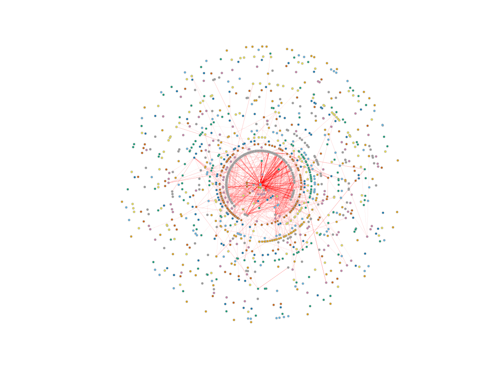

```r
library(vroom)
library(igraph)
library(ggraph)
library(ggplot2)
library(graphlayouts)
library(HMP2Data)
library(phyloseq)
library(dplyr)
library(RColorBrewer)
library(ggforce)
```


```r
inf = vroom("adj_mat_inf.csv") %>% as.matrix()
inf = inf[,-1]
infn = colnames(inf)

rownames(inf) = infn
diag(inf) = 0


sld = vroom("adj_mat_sld.csv") %>% as.matrix()
sld = sld[,-1]
sldn = colnames(sld)
rownames(sld) = sldn
diag(sld) = 0
```

Cargamos matrices de adyacencia como objetos de igraph.


```r
g_inf = graph_from_adjacency_matrix(inf, mode = "undirected", weighted = T)
g_sld = graph_from_adjacency_matrix(sld, mode = "undirected", weighted = T)
```


Cargamos información taxonómica de los OTUs a los mismos objetos de igraph.


```r
T2D = T2D16S()
tax = tax_table(T2D) %>% as.data.frame()

tax_sld = filter(tax, rownames(tax) %in% V(g_sld)$name)
tax_inf = filter(tax, rownames(tax) %in% V(g_inf)$name)

V(g_inf)$Phylum = tax_inf$Phylum
V(g_sld)$Phylum = tax_sld$Phylum

V(g_inf)$Class = tax_inf$Class
V(g_sld)$Class = tax_sld$Class


V(g_inf)$Order= tax_inf$Order
V(g_sld)$Order = tax_sld$Order

V(g_inf)$Family = tax_inf$Family
V(g_sld)$Family = tax_sld$Family


V(g_inf)$Genus = tax_inf$Genus
V(g_sld)$Genus = tax_sld$Genus
```


# Descomposición en k-nucleos

Queremos explorar si existe algún orden o patrón preferencial de los OTUs dentro de los nucleos (cores) de la red.


```r
g_sld_core = g_sld
isolated = which(degree(g_sld_core)==0)
g_sld_core = delete_vertices(g_sld_core, isolated)
E(g_sld_core)$corr = E(g_sld_core)$weight
E(g_sld_core)$weight = abs(E(g_sld_core)$weight)
V(g_sld_core)$size = 1.5
V(g_sld_core)$label = NA
E(g_sld_core)$color = ifelse(E(g_sld_core)$corr >0, "darkseagreen3","red")
E(g_sld_core)$sign = ifelse(E(g_sld_core)$corr >0, "positivo","negativo")
E(g_sld_core)$width = abs(E(g_sld_core)$corr) / 2
V(g_sld_core)$Louvain = cluster_louvain(g_sld_core)
```

```
## Warning in vattrs[[name]][index] <- value: number of items to replace is not a
## multiple of replacement length
```

```r
coreness_sld = coreness(g_sld_core)
V(g_sld_core)$core = coreness_sld
V(g_sld_core)$color =  V(g_sld_core)$core
V(g_sld_core)$frame.color =  "darkgrey"

g_sld_core$palette = categorical_pal(8)


l = layout_with_centrality(g_sld_core, V(g_sld_core)$core)

# Debido a que igraph solo acepta 8 colores categóricos, el color de los nodos
# indica diferentes cores, pero se repiten (hay 41 cores). Por lo tanto en esta
# red se resalta más el signo de las interacciones
plot(g_sld_core, layout = l)
```

<!-- -->

```r
# En esta viz. observamos solo a las interacciones negativas
g_sld_neg = g_sld_core
E(g_sld_neg)$color = ifelse(E(g_sld_core)$corr >0, NA,"red")
l_neg = layout_with_centrality(g_sld_neg, V(g_sld_neg)$core)

plot(g_sld_neg, layout=l_neg)
```

<!-- -->

```r
# En esta viz. el color de los nodos va acorde con la familia a la que pertenece
# cada OTU.
ggraph(g_sld_core,layout = "centrality", centrality = coreness(g_sld_core))+
  draw_circle(use = "cent")+
   annotate_circle(coreness(g_sld_core),format="",pos="bottom", col = "red") +
  geom_edge_link0(width=0.02,colour="lightgrey")+
  geom_node_point(aes(colour=Family),size=0.5)+ 
  theme_graph()
```

<!-- -->

La descomposición de los k-cores de la red de saludables indica que no existe realmente una arreglo preferencial de los OTUs en alguno de los cores a nivel de familia, sin embargo pordríamos analizar esto más a detalle con el análisis de enriquecimiento.


Realizamos el mismo procedimiento para la red de infectados.

```r
g_inf_core = g_inf
V(g_inf_core)$label = NA

isolated = which(degree(g_inf_core)==0)
g_inf_core= delete_vertices(g_inf_core, isolated)
E(g_inf_core)$corr = E(g_inf_core)$weight
E(g_inf_core)$weight = abs(E(g_inf_core)$weight)
V(g_inf_core)$size = 1.5
E(g_inf_core)$color = ifelse(E(g_inf_core)$corr >0, "darkseagreen3","red")
E(g_inf_core)$sign = ifelse(E(g_inf_core)$corr >0, "positivo","negativo")
E(g_inf_core)$width = abs(E(g_inf_core)$corr) / 2

coreness_inf = coreness(g_inf_core)
V(g_inf_core)$core = coreness_inf
V(g_inf_core)$color =  V(g_inf_core)$core
V(g_inf_core)$frame.color =  "darkgrey"

g_inf_core$palette = categorical_pal(8)


li = layout_with_centrality(g_inf_core, V(g_inf_core)$core)


plot(g_inf_core, layout = li )
```

<!-- -->

```r
g_inf_neg = g_inf_core
E(g_inf_neg)$color = ifelse(E(g_inf_neg)$corr >0, NA,"red")
li_neg = layout_with_centrality(g_inf_neg, V(g_inf_neg)$core)

plot(g_inf_neg, layout = li_neg )
```

<!-- -->

```r
ggraph(g_inf_core,layout = "centrality", centrality = coreness_inf)+
  draw_circle(use = "cent")+
   annotate_circle(coreness_inf,format="",pos="top", col = "red") +
  geom_edge_link0(width=0.02, colour= "lightgrey")+
  geom_node_point(aes(color= Family),size=0.3)+
  theme_graph(background = "white")
```

<!-- -->

Algo interesante de ambas descomposiciones, es que las interacciones con signo negativo se centran en los cores más profundos de la red: en la red de saludables se concentran en la subred 38-core, mientras que en la de infectados se concentran en la subred 35-core. Sin embargo, parece que las interacciones negativas son mucho más centrales en la red de infectados que en la de saludables. Además, se puede observar que hay una mayor población de OTUs en los cores más centrales (a partir del 33-core aproximadamente) en la red de saludables contra la de infectados.


# Detección de comunidades y enriquecimiento


```r
back_sld = layout_as_backbone(g_sld_core)
back_inf = layout_as_backbone(g_inf_core)


lou_sld = cluster_louvain(g_sld_core, weights = NULL)
lou_inf = cluster_louvain(g_inf_core, weights = NULL)


infomap_sld = cluster_infomap(g_sld_core)
infomap_inf = cluster_infomap(g_inf_core)

wlkt_sld = walktrap.community(g_sld_core)

wlkt_inf = walktrap.community(g_inf_core)


V(g_sld_core)$louvain = as.factor(lou_sld$membership) 
V(g_inf_core)$louvain = as.factor(lou_inf$membership)
V(g_sld_core)$infomap = as.factor(infomap_sld$membership) 
V(g_inf_core)$infomap = as.factor(infomap_inf$membership)
V(g_sld_core)$wlktrp = as.factor(wlkt_sld$membership) 
V(g_inf_core)$wlktrp = as.factor(wlkt_inf$membership)

V(g_inf_core)$color =  "lightgrey"
V(g_sld_core)$color =  "lightgrey"


max(infomap_inf$modularity)
```

```
## [1] 0.5758818
```

```r
max(infomap_sld$modularity)
```

```
## [1] 0.6116049
```

```r
max(lou_inf$modularity)
```

```
## [1] 0.6162394
```

```r
max(lou_sld$modularity)
```

```
## [1] 0.64039
```

```r
max(wlkt_inf$modularity)
```

```
## [1] 0.5770054
```

```r
max(wlkt_sld$modularity)
```

```
## [1] 0.6168495
```

Se utilizaron tres diferentes algoritmos para la identificación de comunidades en ambas redes: Infomap, Louvain y Walktrap. Los tres obtuvieron valores similares de modularidad, sin embargo, el valor más alto para ambas redes se obtuvo por Louvain. Además, Infomap y Wlktrap identificaban un número mucho más grade de clusters. Debido a lo anterior, se utilizó Louvain para el resto de los análisis.


## Red de saludables


```r
#De igual manera en este plot solo se resaltan los signos de interacción
plot(g_sld_core, layout=back_sld$xy)
```

<!-- -->

```r
# Se resalta a qué familia pertenece cada OTUs
ggraph(g_sld_core, layout =  back_sld$xy)+ 
  geom_edge_link0(aes(width=weight), color='grey')+
  scale_edge_width(range = c(0.01, 0.1))+
  geom_node_point(aes(colour=as.factor(Family)),size=0.5)+ 
  theme_graph()
```

<!-- -->

```r
# Se resalta a qué módulo pertenece cada OTUs
ggraph(g_sld_core, layout =  back_sld$xy)+ 
  geom_edge_link0(aes(width=weight), color='grey')+
  scale_edge_width(range = c(0.01, 0.1))+
  geom_node_point(aes(colour=as.factor(louvain)),size=0.5)+ 
  geom_mark_hull(
    aes(group = louvain, fill = louvain),
    concavity = 4,
    expand = unit(2, "mm"),
    alpha = 0.25
  ) +
  theme_graph()
```

```
## Warning: The concaveman package is required for geom_mark_hull
```

<!-- -->

```r
# Observamos cuáles son los módulos más prominentes

DF_lou_sld = cbind.data.frame(V(g_sld_core)$name, as.factor(V(g_sld_core)$louvain))

colnames(DF_lou_sld) = c("OTU", "Community")

DF_lou_inf = cbind.data.frame(V(g_inf_core)$name, as.factor(V(g_inf_core)$louvain))

colnames(DF_lou_inf) = c("OTU", "Community")

ggplot(DF_lou_sld) +
 aes(x = Community) +
 geom_bar(fill = "lightblue") +
 theme_bw()
```

<!-- -->


## Red de infectados


```r
#interacciones con signo
plot(g_inf_core, layout=back_inf$xy)
```

<!-- -->

```r
# Se resalta a qué familia pertenece cada OTUs
ggraph(g_inf_core, layout =  back_inf$xy)+ 
  geom_edge_link0(aes(width=weight), color='grey')+
  scale_edge_width(range = c(0.01, 0.1))+
  geom_node_point(aes(colour=as.factor(Family)),size=0.5)+ 
  theme_graph()
```

<!-- -->

```r
# Se resalta la comunidad de cada OTU
ggraph(g_inf_core, layout =  back_inf$xy)+ 
  geom_edge_link0(aes(width=weight),colour="grey")+
  scale_edge_width(range = c(0.01, 0.1))+
  geom_node_point(aes(colour=as.factor(louvain)),size=0.5)+ 
  theme_graph()
```

<!-- -->

```r
ggplot(DF_lou_inf) +
 aes(x = Community) +
 geom_bar(fill = "#E963FF") +
 theme_bw()
```

<!-- -->


