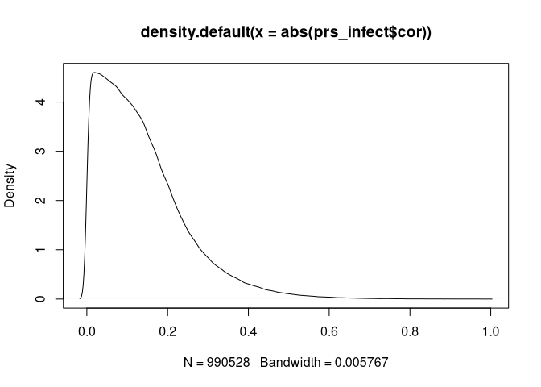

# Construyendo las redes de correlación


```r
library(dplyr)
library(ggplot2)
library(pheatmap)
library(igraph)
library(vroom)
```


Cargamos las tablas que contiene la información de los cálculos de correlación, al igual que sus significancias.


```r
prs_infect <- vroom("prs_infect.csv", col_names = TRUE)
```

```
## New names:
## * `` -> ...1
```

```
## Rows: 990528 Columns: 6
```

```
## ── Column specification ────────────────────────────────────────────────────────
## Delimiter: ","
## dbl (6): ...1, row, column, cor, p, p.adj
```

```
## 
## ℹ Use `spec()` to retrieve the full column specification for this data.
## ℹ Specify the column types or set `show_col_types = FALSE` to quiet this message.
```

```r
prs_infect <- prs_infect[,-1]

prs_salud <- vroom("prs_salud.csv", col_names = T)
```

```
## New names:
## * `` -> ...1
```

```
## Rows: 1076778 Columns: 6
```

```
## ── Column specification ────────────────────────────────────────────────────────
## Delimiter: ","
## dbl (6): ...1, row, column, cor, p, p.adj
```

```
## 
## ℹ Use `spec()` to retrieve the full column specification for this data.
## ℹ Specify the column types or set `show_col_types = FALSE` to quiet this message.
```

```r
prs_salud <- prs_salud[,-1]

head(prs_infect)
```

```
## # A tibble: 6 × 5
##      row column      cor           p     p.adj
##    <dbl>  <dbl>    <dbl>       <dbl>     <dbl>
## 1 198059 985239 0.480    0.000000332 0.0000274
## 2 198059 840914 0.212    0.0321      0.160    
## 3 985239 840914 0.0657   0.512       0.729    
## 4 198059 174924 0.000205 0.998       0.999    
## 5 985239 174924 0.0878   0.380       0.625    
## 6 840914 174924 0.0970   0.332       0.583
```


# Red de correlación de OTUs en infección

Podemos realizar un primer paso de filtración utilizando la significancia estadística de las correlaciones. Para ello nos quedamos solo con las interacciones con un valor de _p.adj_ < 0.01.


También podemos definir un umbral de la fuerza de correlación que podemos incluir en la red. 


```r
prs_infect_fdr <- filter(prs_infect, prs_infect$p.adj < 0.01)

plot(density(abs(prs_infect$cor)))
```

<!-- -->

```r
plot(density(abs(prs_infect_fdr$cor)))
```

<!-- -->

```r
plot(density(prs_infect$p.adj))
```

<!-- -->

```r
plot(density(prs_infect_fdr$p.adj))
```

<!-- -->

```r
#Checamos número de aristas
length(prs_infect_fdr$row)
```

```
## [1] 55857
```

```r
#Checamos número de aristas segun la fuerza de correlación Y FDR
prs_infect_weight <- filter(prs_infect_fdr, abs(prs_infect_fdr$cor) > 0.5 )
length(prs_infect_weight$row)
```

```
## [1] 9624
```


## Distribución del grado


Para poder analizar la distribución del grado, primero necesitamos crear la red en igraph.


```r
g_inf <- graph_from_data_frame(prs_infect_fdr, directed = F)
degree <- degree(g_inf ) %>% as.data.frame()


ggplot(degree) +
 aes(x = .) +
 geom_histogram(bins = 100L, fill = "#114645") +
 labs(x = "Grado de nodo", 
 y = "Frecuencia", title = "Distribución del grado (FDR < 0.01)") +
 theme_minimal() +
 theme(plot.title = element_text(face = "bold", 
 hjust = 0.5))
```

<!-- -->

```r
g_inf_flt <- graph_from_data_frame(prs_infect_weight, directed = F)
degree_flt <- degree(g_inf_flt) %>% as.data.frame()


ggplot(degree_flt) +
 aes(x = .) +
 geom_histogram(bins = 100L, fill = "lightgreen") +
 labs(x = "Grado de nodo", 
 y = "Frecuencia", title = "Distribución del grado (FDR < 0.01, r > 0.5)") +
 theme_minimal() +
 theme(plot.title = element_text(face = "bold", 
 hjust = 0.5))
```

<!-- -->


# Red de correlación de OTUs en paciente saludables


```r
prs_salud_fdr <- filter(prs_salud, prs_salud$p.adj < 0.01)

plot(density(abs(prs_salud$cor)))
```

<!-- -->

```r
plot(density(abs(prs_salud_fdr$cor)))
```

<!-- -->

```r
plot(density(prs_salud$p.adj))
```

<!-- -->

```r
plot(density(prs_salud_fdr$p.adj))
```

<!-- -->

```r
#Checamos número de aristas
length(prs_salud_fdr$row)
```

```
## [1] 115433
```

```r
#Checamos número de aristas segun la fuerza de correlación Y FDR
prs_salud_weight <- filter(prs_salud_fdr, abs(prs_salud_fdr$cor) > 0.5)
length(prs_salud_weight$row)
```

```
## [1] 2082
```


```r
g_sld <- graph_from_data_frame(prs_salud_fdr, directed = F)
degree <- degree(g_sld ) %>% as.data.frame()


ggplot(degree) +
 aes(x = .) +
 geom_histogram(bins = 100L, fill = "coral") +
 labs(x = "Grado de nodo", 
 y = "Frecuencia", title = "Distribución del grado (FDR < 0.01)") +
 theme_minimal() +
 theme(plot.title = element_text(face = "bold", 
 hjust = 0.5))
```

<!-- -->

```r
g_sld_flt <- graph_from_data_frame(prs_salud_weight, directed = F)
degree_flt <- degree(g_sld_flt) %>% as.data.frame()


ggplot(degree_flt) +
 aes(x = .) +
 geom_histogram(bins = 100L, fill = "violet") +
 labs(x = "Grado de nodo", 
 y = "Frecuencia", title = "Distribución del grado (FDR < 0.01, r > 0.5)") +
 theme_minimal() +
 theme(plot.title = element_text(face = "bold", 
 hjust = 0.5))
```

<!-- -->


```r
d1 = density(abs(prs_infect_fdr$cor))
d2 = density(abs(prs_salud_fdr$cor))

plot(d1)
```

<!-- -->

```r
plot(d2)
```

<!-- -->

```r
d1$x[which.max(d1$y)] 
```

```
## [1] 0.3507123
```

```r
d2$x[which.max(d2$y)] 
```

```
## [1] 0.185832
```


```r
ggplot(prs_infect) +
 aes(x = (p.adj), y = (abs(cor))) +
 geom_point(shape = "circle", size = 0.1, colour = "tomato") +
  #xlim(0,1)
 theme_minimal()
```

<!-- -->

```r
ggplot(prs_infect) +
 aes(x = -log(p.adj), y = (abs(cor))) +
 geom_point(shape = "circle", size = 0.1, colour = "tomato") +
  geom_vline(xintercept = c(-log(0.01), -log(0.001))) +
  #xlim(0,1)
 theme_minimal()
```

<!-- -->


```r
ggplot(prs_salud) +
 aes(x = (p.adj), y = (abs(cor))) +
 geom_point(shape = "circle", size = 0.1, colour = "midnightblue") +
 theme_minimal()
```

<!-- -->

```r
ggplot(prs_salud) +
 aes(x = -log(p.adj), y = (abs(cor))) +
 geom_point(shape = "circle", size = 0.1, colour = "midnightblue") +
  geom_vline(xintercept = c(-log(0.01), -log(0.001))) +
 theme_minimal()
```

<!-- -->


```r
intervals = seq(0,1, length.out = 1000)
edges_inf = array()
a = data_frame()
```

```
## Warning: `data_frame()` was deprecated in tibble 1.1.0.
## Please use `tibble()` instead.
```

```r
for (i in seq_along(intervals)) {
  a = filter(prs_infect, abs(prs_infect$cor) > intervals[[i]])
  edges_inf[i] = length(a$p.adj)
}
```


```r
intervals = seq(0,1, length.out = 1000)
edges_sld = array()
a = data_frame()

edge_sld = for (i in seq_along(intervals)) {
  a = filter(prs_salud, abs(prs_salud$cor) > intervals[[i]])
  edges_sld[i] = length(a$p.adj)
}
```


```r
edge_cor = cbind.data.frame(intervals, edges_inf, edges_sld)
head(edge_cor)
```

```
##     intervals edges_inf edges_sld
## 1 0.000000000    990528   1076778
## 2 0.001001001    985736   1068310
## 3 0.002002002    981273   1059696
## 4 0.003003003    976768   1051116
## 5 0.004004004    972101   1042580
## 6 0.005005005    967579   1034073
```

```r
ggplot() + 
geom_line(data=edge_cor, aes(x=intervals, y=edges_inf), color='midnightblue',  linetype = "dashed") + 
geom_line(data=edge_cor, aes(x=intervals, y=edges_sld), color='tomato') + ylim(0,1000000) + theme_minimal()
```

```
## Warning: Removed 10 row(s) containing missing values (geom_path).
```

<!-- -->

```r
ggplot() + 
geom_line(data=edge_cor, aes(x=intervals, y=edges_inf), color='midnightblue',  linetype = "dashed") + 
geom_line(data=edge_cor, aes(x=intervals, y=edges_sld), color='tomato') + ylim(0,10000) + theme_minimal()
```

```
## Warning: Removed 496 row(s) containing missing values (geom_path).
```

```
## Warning: Removed 362 row(s) containing missing values (geom_path).
```

<!-- -->


```r
intervals = seq(0,1, length.out = 1000)
edges_inf = array()
a = data_frame()

for (i in seq_along(intervals)) {
  a = filter(prs_infect_fdr, abs(prs_infect_fdr$cor) > intervals[[i]])
  edges_inf[i] = length(a$p.adj)
}
```


```r
intervals = seq(0,1, length.out = 1000)
edges_sld = array()
a = data_frame()

edge_sld = for (i in seq_along(intervals)) {
  a = filter(prs_salud_fdr, abs(prs_salud_fdr$cor) > intervals[[i]])
  edges_sld[i] = length(a$p.adj)
}
```


```r
edge_cor = cbind.data.frame(intervals, edges_inf, edges_sld)
head(edge_cor)
```

```
##     intervals edges_inf edges_sld
## 1 0.000000000     55857    115433
## 2 0.001001001     55857    115433
## 3 0.002002002     55857    115433
## 4 0.003003003     55857    115433
## 5 0.004004004     55857    115433
## 6 0.005005005     55857    115433
```

```r
ggplot() + 
geom_line(data=edge_cor, aes(x=intervals, y=edges_inf), color='midnightblue',  linetype = "dashed") + 
geom_line(data=edge_cor, aes(x=intervals, y=edges_sld), color='tomato') + ylim(0,1000000) + theme_minimal()
```

<!-- -->

```r
ggplot() + 
geom_line(data=edge_cor, aes(x=intervals, y=edges_inf), color='midnightblue',  linetype = "dashed") + 
geom_line(data=edge_cor, aes(x=intervals, y=edges_sld), color='tomato') + ylim(0,500) + theme_minimal()
```

```
## Warning: Removed 772 row(s) containing missing values (geom_path).
```

```
## Warning: Removed 652 row(s) containing missing values (geom_path).
```

<!-- -->


