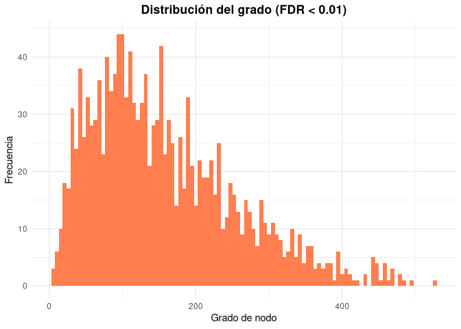

# Construyendo las redes de correlación


```r
library(dplyr)
library(ggplot2)
library(pheatmap)
library(igraph)
```


Cargamos las tablas que contiene la información de los cálculos de correlación, al igual que sus significancias.


```r
prs_infect <- read.csv("prs_infect.csv", header = T, sep = ",")
prs_infect <- prs_infect[,-1]

prs_salud <- read.csv("prs_salud.csv", header = T, sep = ",")
prs_salud <- prs_salud[,-1]

head(prs_infect)
```

```
##      row column        cor            p        p.adj
## 1 198059 985239 0.50431193 6.512771e-08 5.840716e-06
## 2 198059 840914 0.21693627 2.851712e-02 3.038743e-01
## 3 985239 840914 0.07321160 4.646141e-01 9.756607e-01
## 4 198059 174924 0.04172794 6.771034e-01 9.756607e-01
## 5 985239 174924 0.13681751 1.703074e-01 9.472782e-01
## 6 840914 174924 0.10374052 2.994480e-01 9.756607e-01
```


# Red de correlación de OTUs en infección

Podemos realizar un primer paso de filtración utilizando la significancia estadística de las correlaciones. Para ello nos quedamos solo con las interacciones con un valor de _p.adj_ < 0.01.


También podemos definir un umbral de la fuerza de correlación que podemos incluir en la red. 


```r
prs_infect_fdr <- filter(prs_infect, prs_infect$p.adj < 0.01)

plot(density(prs_infect$cor))
```

<!-- -->

```r
plot(density(prs_infect_fdr$cor))
```

<!-- -->

```r
#Checamos número de aristas
length(prs_infect_fdr$row)
```

```
## [1] 319594
```

```r
#Checamos número de aristas segun la fuerza de correlación Y FDR
prs_infect_weight <- filter(prs_infect_fdr, abs(prs_infect_fdr$cor) > 0.5 )
length(prs_infect_weight$row)
```

```
## [1] 105576
```


## Distribución del grado


Para poder analizar la distribución del grado, primero necesitamos crear la red en igraph.


```r
g_inf <- graph_from_data_frame(prs_infect_fdr, directed = F)
degree <- degree(g_inf ) %>% as.data.frame()


ggplot(degree) +
 aes(x = .) +
 geom_histogram(bins = 100L, fill = "#114645") +
 labs(x = "Grado de nodo", 
 y = "Frecuencia", title = "Distribución del grado (FDR < 0.01)") +
 theme_minimal() +
 theme(plot.title = element_text(face = "bold", 
 hjust = 0.5))
```

<!-- -->

```r
g_inf_flt <- graph_from_data_frame(prs_infect_weight, directed = F)
degree_flt <- degree(g_inf_flt) %>% as.data.frame()


ggplot(degree_flt) +
 aes(x = .) +
 geom_histogram(bins = 100L, fill = "lightgreen") +
 labs(x = "Grado de nodo", 
 y = "Frecuencia", title = "Distribución del grado (FDR < 0.01, r > 0.5)") +
 theme_minimal() +
 theme(plot.title = element_text(face = "bold", 
 hjust = 0.5))
```

<!-- -->


# Red de correlación de OTUs en paciente saludables


```r
prs_salud_fdr <- filter(prs_salud, prs_salud$p.adj < 0.01)

plot(density(prs_salud$cor))
```

<!-- -->

```r
plot(density(prs_salud_fdr$cor))
```

<!-- -->

```r
#Checamos número de aristas
length(prs_salud_fdr$row)
```

```
## [1] 566203
```

```r
#Checamos número de aristas segun la fuerza de correlación Y FDR
prs_salud_weight <- filter(prs_salud_fdr, abs(prs_salud_fdr$cor) > 0.5)
length(prs_salud_weight$row)
```

```
## [1] 33838
```


```r
g_sld <- graph_from_data_frame(prs_salud_fdr, directed = F)
degree <- degree(g_sld ) %>% as.data.frame()


ggplot(degree) +
 aes(x = .) +
 geom_histogram(bins = 100L, fill = "coral") +
 labs(x = "Grado de nodo", 
 y = "Frecuencia", title = "Distribución del grado (FDR < 0.01)") +
 theme_minimal() +
 theme(plot.title = element_text(face = "bold", 
 hjust = 0.5))
```

<!-- -->

```r
g_sld_flt <- graph_from_data_frame(prs_salud_weight, directed = F)
degree_flt <- degree(g_sld_flt) %>% as.data.frame()


ggplot(degree_flt) +
 aes(x = .) +
 geom_histogram(bins = 100L, fill = "violet") +
 labs(x = "Grado de nodo", 
 y = "Frecuencia", title = "Distribución del grado (FDR < 0.01, r > 0.5)") +
 theme_minimal() +
 theme(plot.title = element_text(face = "bold", 
 hjust = 0.5))
```

<!-- -->


