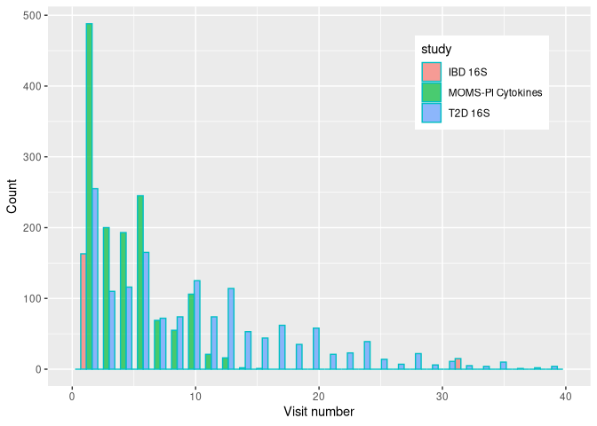

Esta librería nos permite acceder a los datos procesados de tres estudios dentro del proyecto del microbioma humano (HMP): MOMS-PI (*MULTI-OMIC MICROBIOME STUDY PREGNANCY INITIATIVE*), IBD (*INFLAMMATORY BOWEL DISEASE*), y T2D (*TYPE 2 DIABETES*). 


```r
library(HMP2Data)
library(phyloseq)
library(SummarizedExperiment)
library(MultiAssayExperiment)
library(dplyr)
library(ggplot2)
library(UpSetR)
```

# MOMS-PI

En este apartado se ilustra cómo se cargan los datos del proyecto MOMS-PI.

### Datos de 16S

La matriz de datos contiene 7665 taxones como Greengene IDs(GIDs) por 9107 muestras. 


```r
data("momspi16S_mtx")
dim(momspi16S_mtx)
```

```
## [1] 7665 9107
```

```r
momspi16S_mtx[1:5, 1:3]
```

```
##        EP003595_K10_MV1D EP003595_K100_BRCD EP003595_K90_BCKD
## 807795                20                  0                 0
## 134726                 1                  0                 0
## 215097                 2                  0                 0
## 542066                 1                  0                 0
## 851634                 1                  0                 0
```


La matriz momspi16S_tax contiene las clasificaciones taxonómicas de todos los 7665 GIDs presentes en en la tabla de muestras.


```r
data("momspi16S_tax")
dim(momspi16S_tax)
```

```
## [1] 7665    7
```

```r
colnames(momspi16S_tax)
```

```
## [1] "Kingdom" "Phylum"  "Class"   "Order"   "Family"  "Genus"   "Species"
```

```r
momspi16S_tax[1:5, 1:5]
```

```
##        Kingdom    Phylum           Class                Order            
## 807795 "Bacteria" "Firmicutes"     "Bacilli"            "Lactobacillales"
## 134726 "Bacteria" "Firmicutes"     "Bacilli"            "Lactobacillales"
## 215097 "Bacteria" "Proteobacteria" "Betaproteobacteria" "Burkholderiales"
## 542066 "Bacteria" "Actinobacteria" "Actinobacteria"     "Actinomycetales"
## 851634 "Bacteria" "Bacteroidetes"  "Bacteroidia"        "Bacteroidales"  
##        Family            
## 807795 "Lactobacillaceae"
## 134726 "Lactobacillaceae"
## 215097 "Alcaligenaceae"  
## 542066 NA                
## 851634 "Prevotellaceae"
```


La matriz momspi16S_samp contiene las anotaciones de todas las 9107 muestras,


```r
data("momspi16S_samp")
dim(momspi16S_samp)
```

```
## [1] 9107   13
```

```r
colnames(momspi16S_samp)
```

```
##  [1] "file_id"          "md5"              "size"             "urls"            
##  [5] "sample_id"        "file_name"        "subject_id"       "sample_body_site"
##  [9] "visit_number"     "subject_gender"   "subject_race"     "study_full_name" 
## [13] "project_name"
```

```r
momspi16S_samp[1:5, 1:3]
```

```
##                                             file_id
## EP003595_K10_MV1D  e50d0c183689e4053ccb35f8b21a49f3
## EP003595_K100_BRCD e50d0c183689e4053ccb35f8b2764c15
## EP003595_K90_BCKD  e50d0c183689e4053ccb35f8b21cadf2
## EP003595_K90_BRCD  e50d0c183689e4053ccb35f8b220d6c8
## EP004835_K10_MCKD  6d91411d5ede0689305232cc77a70550
##                                                 md5   size
## EP003595_K10_MV1D  414907dbe12def470ca5395c6ac52947  45248
## EP003595_K100_BRCD 90fa414ae826af7ed836e26d34244e2c  41152
## EP003595_K90_BCKD  46516ead384e98552532f8980c9db06c  37056
## EP003595_K90_BRCD  eea4e103b75e2dc94e1a0657840e3edc  37056
## EP004835_K10_MCKD  3b0b16edee96c3d3429408140c2a7f0e 105809
```

 
HMP2Data tiene la función momspi16S() para juntar las tres matrices en un objeto de phyloseq. Después, resulta más facil llamar cada matriz usando las funciones de phyloseq.


```r
momspi16S_phyloseq <- momspi16S()
momspi16S_phyloseq
```

```
## phyloseq-class experiment-level object
## otu_table()   OTU Table:         [ 7665 taxa and 9107 samples ]
## sample_data() Sample Data:       [ 9107 samples by 13 sample variables ]
## tax_table()   Taxonomy Table:    [ 7665 taxa by 7 taxonomic ranks ]
```

```r
otus = otu_table(momspi16S_phyloseq) %>% as.data.frame()
otus[1:3, 1:3]
```

```
##        EP003595_K10_MV1D EP003595_K100_BRCD EP003595_K90_BCKD
## 807795                20                  0                 0
## 134726                 1                  0                 0
## 215097                 2                  0                 0
```

```r
#La función otu_table extrae solo la tabla de otus del objeto phyloseq
#Se puede convertir a data frame o quedarse como objeto otu_table.
```


### Datos de citocinas de MOMS-PI


MOMS-PI es uno de los estudios que provee datos de otro tipo como los perfiles de citocinas. Podemos acceder a estos datos de manera similar a los de 16S.


```r
data("momspiCyto_mtx")
dim(momspiCyto_mtx)
```

```
## [1]   29 1396
```

```r
momspiCyto_mtx[1:5,1:5]
```

```
##         EP004835_K10_MVAX EP004835_K20_MVAX EP004835_K30_MVAX EP004835_K40_MVAX
## Eotaxin             68.05             60.08             37.84             31.87
## FGF                265.45             -2.00             -2.00            108.76
## G-CSF              624.79           2470.70             -2.00             -2.00
## GM-CSF              51.39             -2.00             42.01             28.75
## IFN-g              164.58            193.22            184.53            185.97
##         EP004835_K50_MVAX
## Eotaxin             23.75
## FGF                 78.31
## G-CSF               -2.00
## GM-CSF              -2.00
## IFN-g              116.39
```


Cargamos la anotación de las muestras


```r
data("momspiCyto_samp")
dim(momspiCyto_samp)
```

```
## [1] 1396   13
```

```r
colnames(momspiCyto_samp)
```

```
##  [1] "file_id"          "md5"              "size"             "urls"            
##  [5] "sample_id"        "file_name"        "subject_id"       "sample_body_site"
##  [9] "visit_number"     "subject_gender"   "subject_race"     "study_full_name" 
## [13] "project_name"
```


La función de HMP2Data momspiCytokines() crea un objeto de *Summarized Experiment*


```r
momspiCyto = momspiCytokines()
momspiCyto
```

```
## class: SummarizedExperiment 
## dim: 29 1396 
## metadata(0):
## assays(1): ''
## rownames(29): Eotaxin FGF ... FGF basic IL-17
## rowData names(1): cytokine
## colnames(1396): EP004835_K10_MVAX EP004835_K20_MVAX ...
##   EP996091_K40_MVAX EP996091_K60_MVAX
## colData names(13): file_id md5 ... study_full_name project_name
```


### Multi-ensayos


Podemos contruir un experimento que contenga la información tanto de los datos de 16S como de los perfiles de citocinas para las muestras que tengan ambos disponibles. Para eso se utiliza la función momspiMultiAssay().


```r
momspiMA <- momspiMultiAssay()
momspiMA
```

```
## A MultiAssayExperiment object of 2 listed
##  experiments with user-defined names and respective classes.
##  Containing an ExperimentList class object of length 2:
##  [1] 16S: matrix with 7665 rows and 9107 columns
##  [2] cytokines: matrix with 29 rows and 1396 columns
## Functionality:
##  experiments() - obtain the ExperimentList instance
##  colData() - the primary/phenotype DataFrame
##  sampleMap() - the sample coordination DataFrame
##  `$`, `[`, `[[` - extract colData columns, subset, or experiment
##  *Format() - convert into a long or wide DataFrame
##  assays() - convert ExperimentList to a SimpleList of matrices
##  exportClass() - save all data to files
```


Con el objeto momspiMA, podemos seleccionar datos tanto de 16S como de citocinas. De igual manera, podemos seleccionar la intersección de las muestras que tienen datos tanto de 16S como de citocinas.


```r
momsrRNA = momspiMA[[1L]]
cyto = momspiMA[[2L]]

#completeMA contiene la interección de muestras.
completeMA = intersectColumns(momspiMA)
```

```
## harmonizing input:
##   removing 2 sampleMap rows with 'colname' not in colnames of experiments
```

```r
completeMA
```

```
## A MultiAssayExperiment object of 2 listed
##  experiments with user-defined names and respective classes.
##  Containing an ExperimentList class object of length 2:
##  [1] 16S: matrix with 7665 rows and 0 columns
##  [2] cytokines: matrix with 29 rows and 0 columns
## Functionality:
##  experiments() - obtain the ExperimentList instance
##  colData() - the primary/phenotype DataFrame
##  sampleMap() - the sample coordination DataFrame
##  `$`, `[`, `[[` - extract colData columns, subset, or experiment
##  *Format() - convert into a long or wide DataFrame
##  assays() - convert ExperimentList to a SimpleList of matrices
##  exportClass() - save all data to files
```


# IBD y T2D

De igual manera que MOMS-PI, se pueden cargar rápidamente los datos de IBD y T2D como un objeto de phyloseq que contiene toda la información de interés.


```r
IBD = IBD16S()
IBD
```

```
## phyloseq-class experiment-level object
## otu_table()   OTU Table:         [ 982 taxa and 178 samples ]
## sample_data() Sample Data:       [ 178 samples by 490 sample variables ]
## tax_table()   Taxonomy Table:    [ 982 taxa by 6 taxonomic ranks ]
```

```r
T2D = T2D16S()
T2D
```

```
## phyloseq-class experiment-level object
## otu_table()   OTU Table:         [ 12062 taxa and 2208 samples ]
## sample_data() Sample Data:       [ 2208 samples by 13 sample variables ]
## tax_table()   Taxonomy Table:    [ 12062 taxa by 7 taxonomic ranks ]
```


# Tablas de frecuencia


HMP2Data tiene la función table_two() para generar una tabla con las frecuencias de las anotaciones de cada muestra en los tres estudios.


```r
list("MOMS-PI 16S" = momspi16S_phyloseq, "MOMS-PI Cytokines" = momspiCyto,
     "IBD 16S" = IBD, "T2D 16S" = T2D) %>% table_two()
```

<table class="table table-condensed" style="margin-left: auto; margin-right: auto;">
 <thead>
<tr>
<th style="empty-cells: hide;border-bottom:hidden;" colspan="1"></th>
<th style="border-bottom:hidden;padding-bottom:0; padding-left:3px;padding-right:3px;text-align: center; " colspan="2"><div style="border-bottom: 1px solid #ddd; padding-bottom: 5px; ">MOMS-PI 16S</div></th>
<th style="border-bottom:hidden;padding-bottom:0; padding-left:3px;padding-right:3px;text-align: center; " colspan="2"><div style="border-bottom: 1px solid #ddd; padding-bottom: 5px; ">MOMS-PI Cytokines</div></th>
<th style="border-bottom:hidden;padding-bottom:0; padding-left:3px;padding-right:3px;text-align: center; " colspan="2"><div style="border-bottom: 1px solid #ddd; padding-bottom: 5px; ">IBD 16S</div></th>
<th style="border-bottom:hidden;padding-bottom:0; padding-left:3px;padding-right:3px;text-align: center; " colspan="2"><div style="border-bottom: 1px solid #ddd; padding-bottom: 5px; ">T2D 16S</div></th>
</tr>
  <tr>
   <th style="text-align:left;">  </th>
   <th style="text-align:left;"> N </th>
   <th style="text-align:left;"> % </th>
   <th style="text-align:left;"> N </th>
   <th style="text-align:left;"> % </th>
   <th style="text-align:left;"> N </th>
   <th style="text-align:left;"> % </th>
   <th style="text-align:left;"> N </th>
   <th style="text-align:left;"> % </th>
  </tr>
 </thead>
<tbody>
  <tr>
   <td style="text-align:left;"> **Body Site** </td>
   <td style="text-align:left;">  </td>
   <td style="text-align:left;">  </td>
   <td style="text-align:left;">  </td>
   <td style="text-align:left;">  </td>
   <td style="text-align:left;">  </td>
   <td style="text-align:left;">  </td>
   <td style="text-align:left;">  </td>
   <td style="text-align:left;">  </td>
  </tr>
  <tr>
   <td style="text-align:left;"> buccal mucosa </td>
   <td style="text-align:left;"> 3313 </td>
   <td style="text-align:left;"> 36.38 </td>
   <td style="text-align:left;"> 311 </td>
   <td style="text-align:left;"> 22.28 </td>
   <td style="text-align:left;"> 0 </td>
   <td style="text-align:left;"> 0 </td>
   <td style="text-align:left;"> 0 </td>
   <td style="text-align:left;"> 0 </td>
  </tr>
  <tr>
   <td style="text-align:left;"> cervix of uterus </td>
   <td style="text-align:left;"> 162 </td>
   <td style="text-align:left;"> 1.78 </td>
   <td style="text-align:left;"> 0 </td>
   <td style="text-align:left;"> 0 </td>
   <td style="text-align:left;"> 0 </td>
   <td style="text-align:left;"> 0 </td>
   <td style="text-align:left;"> 0 </td>
   <td style="text-align:left;"> 0 </td>
  </tr>
  <tr>
   <td style="text-align:left;"> feces </td>
   <td style="text-align:left;"> 765 </td>
   <td style="text-align:left;"> 8.4 </td>
   <td style="text-align:left;"> 0 </td>
   <td style="text-align:left;"> 0 </td>
   <td style="text-align:left;"> 0 </td>
   <td style="text-align:left;"> 0 </td>
   <td style="text-align:left;"> 1041 </td>
   <td style="text-align:left;"> 47.15 </td>
  </tr>
  <tr>
   <td style="text-align:left;"> rectum </td>
   <td style="text-align:left;"> 2679 </td>
   <td style="text-align:left;"> 29.42 </td>
   <td style="text-align:left;"> 0 </td>
   <td style="text-align:left;"> 0 </td>
   <td style="text-align:left;"> 0 </td>
   <td style="text-align:left;"> 0 </td>
   <td style="text-align:left;"> 0 </td>
   <td style="text-align:left;"> 0 </td>
  </tr>
  <tr>
   <td style="text-align:left;"> unknown </td>
   <td style="text-align:left;"> 146 </td>
   <td style="text-align:left;"> 1.6 </td>
   <td style="text-align:left;"> 0 </td>
   <td style="text-align:left;"> 0 </td>
   <td style="text-align:left;"> 0 </td>
   <td style="text-align:left;"> 0 </td>
   <td style="text-align:left;"> 0 </td>
   <td style="text-align:left;"> 0 </td>
  </tr>
  <tr>
   <td style="text-align:left;"> vagina </td>
   <td style="text-align:left;"> 2042 </td>
   <td style="text-align:left;"> 22.42 </td>
   <td style="text-align:left;"> 979 </td>
   <td style="text-align:left;"> 70.13 </td>
   <td style="text-align:left;"> 0 </td>
   <td style="text-align:left;"> 0 </td>
   <td style="text-align:left;"> 0 </td>
   <td style="text-align:left;"> 0 </td>
  </tr>
  <tr>
   <td style="text-align:left;"> blood cell </td>
   <td style="text-align:left;"> 0 </td>
   <td style="text-align:left;"> 0 </td>
   <td style="text-align:left;"> 106 </td>
   <td style="text-align:left;"> 7.59 </td>
   <td style="text-align:left;"> 0 </td>
   <td style="text-align:left;"> 0 </td>
   <td style="text-align:left;"> 0 </td>
   <td style="text-align:left;"> 0 </td>
  </tr>
  <tr>
   <td style="text-align:left;"> nasal cavity </td>
   <td style="text-align:left;"> 0 </td>
   <td style="text-align:left;"> 0 </td>
   <td style="text-align:left;"> 0 </td>
   <td style="text-align:left;"> 0 </td>
   <td style="text-align:left;"> 0 </td>
   <td style="text-align:left;"> 0 </td>
   <td style="text-align:left;"> 1167 </td>
   <td style="text-align:left;"> 52.85 </td>
  </tr>
  <tr>
   <td style="text-align:left;"> **Sex** </td>
   <td style="text-align:left;">  </td>
   <td style="text-align:left;">  </td>
   <td style="text-align:left;">  </td>
   <td style="text-align:left;">  </td>
   <td style="text-align:left;">  </td>
   <td style="text-align:left;">  </td>
   <td style="text-align:left;">  </td>
   <td style="text-align:left;">  </td>
  </tr>
  <tr>
   <td style="text-align:left;"> male </td>
   <td style="text-align:left;"> 0 </td>
   <td style="text-align:left;"> 0 </td>
   <td style="text-align:left;"> 0 </td>
   <td style="text-align:left;"> 0 </td>
   <td style="text-align:left;"> 84 </td>
   <td style="text-align:left;"> 47.19 </td>
   <td style="text-align:left;"> 1248 </td>
   <td style="text-align:left;"> 56.52 </td>
  </tr>
  <tr>
   <td style="text-align:left;"> female </td>
   <td style="text-align:left;"> 9107 </td>
   <td style="text-align:left;"> 100 </td>
   <td style="text-align:left;"> 1396 </td>
   <td style="text-align:left;"> 100 </td>
   <td style="text-align:left;"> 94 </td>
   <td style="text-align:left;"> 52.81 </td>
   <td style="text-align:left;"> 947 </td>
   <td style="text-align:left;"> 42.89 </td>
  </tr>
  <tr>
   <td style="text-align:left;"> unknown </td>
   <td style="text-align:left;"> 0 </td>
   <td style="text-align:left;"> 0 </td>
   <td style="text-align:left;"> 0 </td>
   <td style="text-align:left;"> 0 </td>
   <td style="text-align:left;"> 0 </td>
   <td style="text-align:left;"> 0 </td>
   <td style="text-align:left;"> 13 </td>
   <td style="text-align:left;"> 0.59 </td>
  </tr>
  <tr>
   <td style="text-align:left;"> **Race** </td>
   <td style="text-align:left;">  </td>
   <td style="text-align:left;">  </td>
   <td style="text-align:left;">  </td>
   <td style="text-align:left;">  </td>
   <td style="text-align:left;">  </td>
   <td style="text-align:left;">  </td>
   <td style="text-align:left;">  </td>
   <td style="text-align:left;">  </td>
  </tr>
  <tr>
   <td style="text-align:left;"> african american </td>
   <td style="text-align:left;"> 0 </td>
   <td style="text-align:left;"> 0 </td>
   <td style="text-align:left;"> 0 </td>
   <td style="text-align:left;"> 0 </td>
   <td style="text-align:left;"> 0 </td>
   <td style="text-align:left;"> 0 </td>
   <td style="text-align:left;"> 117 </td>
   <td style="text-align:left;"> 5.3 </td>
  </tr>
  <tr>
   <td style="text-align:left;"> asian </td>
   <td style="text-align:left;"> 0 </td>
   <td style="text-align:left;"> 0 </td>
   <td style="text-align:left;"> 0 </td>
   <td style="text-align:left;"> 0 </td>
   <td style="text-align:left;"> 0 </td>
   <td style="text-align:left;"> 0 </td>
   <td style="text-align:left;"> 235 </td>
   <td style="text-align:left;"> 10.64 </td>
  </tr>
  <tr>
   <td style="text-align:left;"> caucasian </td>
   <td style="text-align:left;"> 0 </td>
   <td style="text-align:left;"> 0 </td>
   <td style="text-align:left;"> 0 </td>
   <td style="text-align:left;"> 0 </td>
   <td style="text-align:left;"> 0 </td>
   <td style="text-align:left;"> 0 </td>
   <td style="text-align:left;"> 1657 </td>
   <td style="text-align:left;"> 75.05 </td>
  </tr>
  <tr>
   <td style="text-align:left;"> ethnic other </td>
   <td style="text-align:left;"> 0 </td>
   <td style="text-align:left;"> 0 </td>
   <td style="text-align:left;"> 0 </td>
   <td style="text-align:left;"> 0 </td>
   <td style="text-align:left;"> 0 </td>
   <td style="text-align:left;"> 0 </td>
   <td style="text-align:left;"> 73 </td>
   <td style="text-align:left;"> 3.31 </td>
  </tr>
  <tr>
   <td style="text-align:left;"> hispanic or latino </td>
   <td style="text-align:left;"> 0 </td>
   <td style="text-align:left;"> 0 </td>
   <td style="text-align:left;"> 0 </td>
   <td style="text-align:left;"> 0 </td>
   <td style="text-align:left;"> 0 </td>
   <td style="text-align:left;"> 0 </td>
   <td style="text-align:left;"> 126 </td>
   <td style="text-align:left;"> 5.71 </td>
  </tr>
  <tr>
   <td style="text-align:left;"> american indian or alaska native </td>
   <td style="text-align:left;"> 0 </td>
   <td style="text-align:left;"> 0 </td>
   <td style="text-align:left;"> 0 </td>
   <td style="text-align:left;"> 0 </td>
   <td style="text-align:left;"> 0 </td>
   <td style="text-align:left;"> 0 </td>
   <td style="text-align:left;"> 0 </td>
   <td style="text-align:left;"> 0 </td>
  </tr>
  <tr>
   <td style="text-align:left;"> unknown </td>
   <td style="text-align:left;"> 9107 </td>
   <td style="text-align:left;"> 100 </td>
   <td style="text-align:left;"> 1396 </td>
   <td style="text-align:left;"> 100 </td>
   <td style="text-align:left;"> 178 </td>
   <td style="text-align:left;"> 100 </td>
   <td style="text-align:left;"> 0 </td>
   <td style="text-align:left;"> 0 </td>
  </tr>
  <tr>
   <td style="text-align:left;"> **total samples** </td>
   <td style="text-align:left;"> 9107 </td>
   <td style="text-align:left;"> 100 </td>
   <td style="text-align:left;"> 1396 </td>
   <td style="text-align:left;"> 100 </td>
   <td style="text-align:left;"> 178 </td>
   <td style="text-align:left;"> 100 </td>
   <td style="text-align:left;"> 2208 </td>
   <td style="text-align:left;"> 100 </td>
  </tr>
</tbody>
</table>


También podemos observar el número de pacientes que incluye cada estudio


```r
list("MOMS-PI 16S" = momspi16S_phyloseq, "MOMS-PI Cytokines" = momspiCyto, "IBD 16S" = IBD, "T2D 16S" = T2D) %>% patient_table()
```

<table class="table table-condensed" style="margin-left: auto; margin-right: auto;">
 <thead>
<tr>
<th style="empty-cells: hide;border-bottom:hidden;" colspan="1"></th>
<th style="border-bottom:hidden;padding-bottom:0; padding-left:3px;padding-right:3px;text-align: center; " colspan="2"><div style="border-bottom: 1px solid #ddd; padding-bottom: 5px; ">MOMS-PI 16S</div></th>
<th style="border-bottom:hidden;padding-bottom:0; padding-left:3px;padding-right:3px;text-align: center; " colspan="2"><div style="border-bottom: 1px solid #ddd; padding-bottom: 5px; ">MOMS-PI Cytokines</div></th>
<th style="border-bottom:hidden;padding-bottom:0; padding-left:3px;padding-right:3px;text-align: center; " colspan="2"><div style="border-bottom: 1px solid #ddd; padding-bottom: 5px; ">IBD 16S</div></th>
<th style="border-bottom:hidden;padding-bottom:0; padding-left:3px;padding-right:3px;text-align: center; " colspan="2"><div style="border-bottom: 1px solid #ddd; padding-bottom: 5px; ">T2D 16S</div></th>
</tr>
  <tr>
   <th style="text-align:left;">  </th>
   <th style="text-align:left;"> N </th>
   <th style="text-align:left;"> % </th>
   <th style="text-align:left;"> N </th>
   <th style="text-align:left;"> % </th>
   <th style="text-align:left;"> N </th>
   <th style="text-align:left;"> % </th>
   <th style="text-align:left;"> N </th>
   <th style="text-align:left;"> % </th>
  </tr>
 </thead>
<tbody>
  <tr>
   <td style="text-align:left;"> **Sex** </td>
   <td style="text-align:left;">  </td>
   <td style="text-align:left;">  </td>
   <td style="text-align:left;">  </td>
   <td style="text-align:left;">  </td>
   <td style="text-align:left;">  </td>
   <td style="text-align:left;">  </td>
   <td style="text-align:left;">  </td>
   <td style="text-align:left;">  </td>
  </tr>
  <tr>
   <td style="text-align:left;"> male </td>
   <td style="text-align:left;"> 0 </td>
   <td style="text-align:left;"> 0 </td>
   <td style="text-align:left;"> 0 </td>
   <td style="text-align:left;"> 0 </td>
   <td style="text-align:left;"> 41 </td>
   <td style="text-align:left;"> 50.62 </td>
   <td style="text-align:left;"> 38 </td>
   <td style="text-align:left;"> 46.34 </td>
  </tr>
  <tr>
   <td style="text-align:left;"> female </td>
   <td style="text-align:left;"> 596 </td>
   <td style="text-align:left;"> 100 </td>
   <td style="text-align:left;"> 235 </td>
   <td style="text-align:left;"> 100 </td>
   <td style="text-align:left;"> 40 </td>
   <td style="text-align:left;"> 49.38 </td>
   <td style="text-align:left;"> 39 </td>
   <td style="text-align:left;"> 47.56 </td>
  </tr>
  <tr>
   <td style="text-align:left;"> unknown </td>
   <td style="text-align:left;"> 0 </td>
   <td style="text-align:left;"> 0 </td>
   <td style="text-align:left;"> 0 </td>
   <td style="text-align:left;"> 0 </td>
   <td style="text-align:left;"> 0 </td>
   <td style="text-align:left;"> 0 </td>
   <td style="text-align:left;"> 5 </td>
   <td style="text-align:left;"> 6.1 </td>
  </tr>
  <tr>
   <td style="text-align:left;"> **Race** </td>
   <td style="text-align:left;">  </td>
   <td style="text-align:left;">  </td>
   <td style="text-align:left;">  </td>
   <td style="text-align:left;">  </td>
   <td style="text-align:left;">  </td>
   <td style="text-align:left;">  </td>
   <td style="text-align:left;">  </td>
   <td style="text-align:left;">  </td>
  </tr>
  <tr>
   <td style="text-align:left;"> african american </td>
   <td style="text-align:left;"> 0 </td>
   <td style="text-align:left;"> 0 </td>
   <td style="text-align:left;"> 0 </td>
   <td style="text-align:left;"> 0 </td>
   <td style="text-align:left;"> 0 </td>
   <td style="text-align:left;"> 0 </td>
   <td style="text-align:left;"> 4 </td>
   <td style="text-align:left;"> 4.88 </td>
  </tr>
  <tr>
   <td style="text-align:left;"> asian </td>
   <td style="text-align:left;"> 0 </td>
   <td style="text-align:left;"> 0 </td>
   <td style="text-align:left;"> 0 </td>
   <td style="text-align:left;"> 0 </td>
   <td style="text-align:left;"> 0 </td>
   <td style="text-align:left;"> 0 </td>
   <td style="text-align:left;"> 14 </td>
   <td style="text-align:left;"> 17.07 </td>
  </tr>
  <tr>
   <td style="text-align:left;"> caucasian </td>
   <td style="text-align:left;"> 0 </td>
   <td style="text-align:left;"> 0 </td>
   <td style="text-align:left;"> 0 </td>
   <td style="text-align:left;"> 0 </td>
   <td style="text-align:left;"> 0 </td>
   <td style="text-align:left;"> 0 </td>
   <td style="text-align:left;"> 52 </td>
   <td style="text-align:left;"> 63.41 </td>
  </tr>
  <tr>
   <td style="text-align:left;"> ethnic other </td>
   <td style="text-align:left;"> 0 </td>
   <td style="text-align:left;"> 0 </td>
   <td style="text-align:left;"> 0 </td>
   <td style="text-align:left;"> 0 </td>
   <td style="text-align:left;"> 0 </td>
   <td style="text-align:left;"> 0 </td>
   <td style="text-align:left;"> 9 </td>
   <td style="text-align:left;"> 10.98 </td>
  </tr>
  <tr>
   <td style="text-align:left;"> hispanic or latino </td>
   <td style="text-align:left;"> 0 </td>
   <td style="text-align:left;"> 0 </td>
   <td style="text-align:left;"> 0 </td>
   <td style="text-align:left;"> 0 </td>
   <td style="text-align:left;"> 0 </td>
   <td style="text-align:left;"> 0 </td>
   <td style="text-align:left;"> 3 </td>
   <td style="text-align:left;"> 3.66 </td>
  </tr>
  <tr>
   <td style="text-align:left;"> american indian or alaska native </td>
   <td style="text-align:left;"> 0 </td>
   <td style="text-align:left;"> 0 </td>
   <td style="text-align:left;"> 0 </td>
   <td style="text-align:left;"> 0 </td>
   <td style="text-align:left;"> 0 </td>
   <td style="text-align:left;"> 0 </td>
   <td style="text-align:left;"> 0 </td>
   <td style="text-align:left;"> 0 </td>
  </tr>
  <tr>
   <td style="text-align:left;"> unknown </td>
   <td style="text-align:left;"> 596 </td>
   <td style="text-align:left;"> 100 </td>
   <td style="text-align:left;"> 235 </td>
   <td style="text-align:left;"> 100 </td>
   <td style="text-align:left;"> 81 </td>
   <td style="text-align:left;"> 100 </td>
   <td style="text-align:left;"> 0 </td>
   <td style="text-align:left;"> 0 </td>
  </tr>
  <tr>
   <td style="text-align:left;"> **Total patients** </td>
   <td style="text-align:left;"> 596 </td>
   <td style="text-align:left;"> 100 </td>
   <td style="text-align:left;"> 235 </td>
   <td style="text-align:left;"> 100 </td>
   <td style="text-align:left;"> 81 </td>
   <td style="text-align:left;"> 100 </td>
   <td style="text-align:left;"> 82 </td>
   <td style="text-align:left;"> 100 </td>
  </tr>
</tbody>
</table>


Otro dato relevante es el monitoreo de la cantidad de visitas que realizaron los pacientes en cada estudio.


```r
plot_visits <- data.frame(study = c(rep("MOMS-PI Cytokines", nrow(momspiCyto_samp)),
                     rep("IBD 16S", nrow(IBD16S_samp)),
                     rep("T2D 16S", nrow(T2D16S_samp))),
          visits = c(momspiCyto_samp$visit_number,
                     IBD16S_samp$visit_number,
                     T2D16S_samp$visit_number))
p2 <- ggplot(plot_visits, aes(x = visits, fill = study)) + 
  geom_histogram(position = "dodge", alpha = 0.7, bins = 30, color = "#00BFC4") + xlim(c(0, 40)) +
  theme(legend.position = c(0.8, 0.8))  + 
  xlab("Visit number") + ylab("Count")
p2
```

```
## Warning: Removed 677 rows containing non-finite values (stat_bin).
```

```
## Warning: Removed 4 rows containing missing values (geom_bar).
```

<!-- -->


```r
T2D_otu = otu_table(T2D) %>% as.data.frame()
T2D_samp = sample_data(T2D) %>% as.data.frame()
```


```r
moms_samp = sample_data(momspi16S_phyloseq)
```


