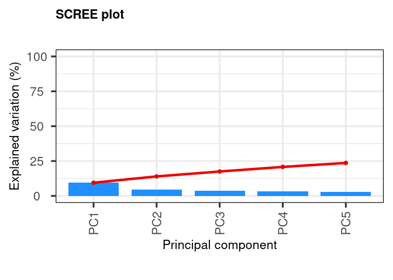
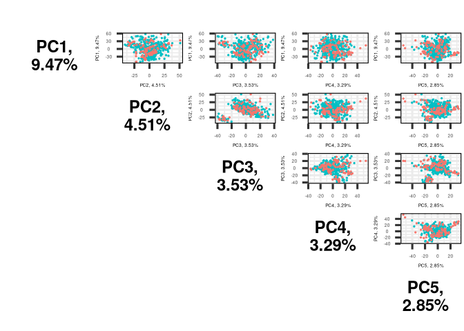

Cargamos las librerias necesarias.


```r
library(HMP2Data)
library(phyloseq)
library(dplyr)
library(stringr)
library(DESeq2)
library(PCAtools)
```


```r
T2D = T2D16S()
T2D_otu = otu_table(T2D) %>% as.data.frame()
T2D_samples = sample_data(T2D) %>% as.data.frame()
```


Teniendo las matrices de OTUs y las respectivas anotaciones de cada muestra, podemos quedarnos solo con las matrices de abundancia que correspondan a las muestras de heces fecales.


```r
T2D_gut_IDs = subset(rownames(T2D_samples), T2D_samples$sample_body_site == "feces")
T2D_otu_gut = select(T2D_otu, T2D_gut_IDs)
```


También necesitamos los datos clínicos disponibles en la pagina del proyecto. Esta tabla contiene información de importancia, como los diagnosticos clínicos de cada paciente durante sus diversas visitas a lo largo del periodo que duró el estudio.


```r
df_clinico = read.csv("clinical_data", sep = "\t")
```


Una vez que solo tenemos las matrices de abundancia de heces fecales, se necesitan relacionar las muestras con la tabla de datos clinicos. Para ello se necesitan analizar los IDs de las muestras, y modificarlas para que coincidan con los IDs de las visitas clínicas.


```r
IDs_no_tail = str_sub(T2D_gut_IDs, 1, -7)
IDs_no_tailhead = str_sub(IDs_no_tail,29,-1)

head(as.data.frame(T2D_gut_IDs))
```

```
##                                      T2D_gut_IDs
## 1   HMP2_J00825_1_ST_T0_B0_0120_ZN9YTFN-01_AA31J
## 2 HMP2_J00826_1_ST_T0_B0_0120_ZN9YTFN-1011_AA31J
## 3 HMP2_J00827_1_ST_T0_B0_0120_ZN9YTFN-1012_AA31J
## 4 HMP2_J00828_1_ST_T0_B0_0120_ZN9YTFN-1013_AA31J
## 5 HMP2_J00829_1_ST_T0_B0_0120_ZN9YTFN-1014_AA31J
## 6 HMP2_J00830_1_ST_T0_B0_0120_ZN9YTFN-1015_AA31J
```

```r
head(as.data.frame(IDs_no_tail))
```

```
##                                IDs_no_tail
## 1   HMP2_J00825_1_ST_T0_B0_0120_ZN9YTFN-01
## 2 HMP2_J00826_1_ST_T0_B0_0120_ZN9YTFN-1011
## 3 HMP2_J00827_1_ST_T0_B0_0120_ZN9YTFN-1012
## 4 HMP2_J00828_1_ST_T0_B0_0120_ZN9YTFN-1013
## 5 HMP2_J00829_1_ST_T0_B0_0120_ZN9YTFN-1014
## 6 HMP2_J00830_1_ST_T0_B0_0120_ZN9YTFN-1015
```

```r
head(as.data.frame(IDs_no_tailhead))
```

```
##   IDs_no_tailhead
## 1      ZN9YTFN-01
## 2    ZN9YTFN-1011
## 3    ZN9YTFN-1012
## 4    ZN9YTFN-1013
## 5    ZN9YTFN-1014
## 6    ZN9YTFN-1015
```


Creamos una nueva tabla de OTUs con los nuevos nombres de columnas.


```r
OTUs_clinical = T2D_otu_gut
colnames(OTUs_clinical) <- NULL
colnames(OTUs_clinical) <- IDs_no_tailhead
```


Utilizando la tabla de datos clínicos, podemos extraer los IDs de las visitas que se encontraban en una infección o al término de la misma, al igual que momentos donde se encontraron saludables.


```r
salud = filter(df_clinico, df_clinico$CL4 == "Healthy")
infeccion = filter(df_clinico, 
                   df_clinico$CL4 == "Infection" | df_clinico$CL4 == "Infection_L")
```


Conseguimos los IDs de las visitas que si tuvieron una muestra de heces en ambas condiciones (salud e infectado).


```r
OTUs_clinical_unique = OTUs_clinical[!duplicated(names(OTUs_clinical))]
OTUs_clinical_IDs = colnames(OTUs_clinical_unique)


salud_IDs = salud$VisitID
salud_IDs_flt = subset(salud_IDs, salud_IDs %in% OTUs_clinical_IDs)


infeccion_IDs = infeccion$VisitID
infeccion_IDs_flt = subset(infeccion_IDs, infeccion_IDs %in% OTUs_clinical_IDs)

#Obtenemos la matriz de OTUs que contiene ambas condiciones anotadas

OTUs_clinical_salud_flt = select(OTUs_clinical_unique, salud_IDs_flt)
```

```
## Note: Using an external vector in selections is ambiguous.
## ℹ Use `all_of(salud_IDs_flt)` instead of `salud_IDs_flt` to silence this message.
## ℹ See <https://tidyselect.r-lib.org/reference/faq-external-vector.html>.
## This message is displayed once per session.
```

```r
OTUs_clinical_infeccion_flt = select(OTUs_clinical_unique, infeccion_IDs_flt)
```

```
## Note: Using an external vector in selections is ambiguous.
## ℹ Use `all_of(infeccion_IDs_flt)` instead of `infeccion_IDs_flt` to silence this message.
## ℹ See <https://tidyselect.r-lib.org/reference/faq-external-vector.html>.
## This message is displayed once per session.
```

```r
OTUs_clinical_complete = cbind(OTUs_clinical_salud_flt, OTUs_clinical_infeccion_flt)
OTUs_clinical_complete_nonzero = OTUs_clinical_complete + 1
```


# Análisis de componentes principales (PCA)

En este paso ya tenemos claros cuáles son las muestras que corresponden a cada condición de interés. En total se extrajeron 343 muesttras de OTUs de pacientes saludables, y 102 de pacientes infectados. El siguiente objetivo es realizar un análisis de PCA  para observar si existe una separación lineal entre las muestras, dadas las condiciones que queremos explorar.


El cálculo del PCA lo podemos realizar con las funciones dentro de la librería **DESeq2**, sin embargo primero necesitamos crear una tabla de metadatos que indique qué muestras corresponden a cada condición.


```r
coldata_salud = cbind(salud_IDs_flt, rep("Saludable", length(salud_IDs_flt))) %>% as.data.frame()
coldata_infeccion = cbind(infeccion_IDs_flt, rep("Infectados", length(infeccion_IDs_flt))) %>% as.data.frame()

colnames(coldata_salud) = c("Visit_ID","condition")
colnames(coldata_infeccion) = c("Visit_ID","condition")

#unimos los dos dfs.

coldata = rbind(coldata_salud, coldata_infeccion)
coldata$condition = factor(coldata$condition)
```


Utilizando la matriz de OTUs y la tabla de metadatos **coldata**, creamos el objeto de DESeq y realizamos el PCA.


```r
#Objeto de DESeq
dds=DESeqDataSetFromMatrix(countData = OTUs_clinical_complete_nonzero, 
                           colData = coldata, design = ~ condition) 
```

```
## converting counts to integer mode
```

```r
#Obtenemos las matrices de abundancia normalizadas por vst y rlog
rld <- varianceStabilizingTransformation(dds, blind=TRUE) 
```

```
## -- note: fitType='parametric', but the dispersion trend was not well captured by the
##    function: y = a/x + b, and a local regression fit was automatically substituted.
##    specify fitType='local' or 'mean' to avoid this message next time.
```

```r
#rlog_data = rlog(dds, blind = TRUE)
#rlog_data = assay(rlog_data)
#write.csv(rlog_data, "rlog_otus.csv")

#Graficamos(vst)
plotPCA(rld, intgroup="condition")
```

<!-- -->


Podemos observar que no existe ningún tipo de separación entre las condiciones establecidas. Podemos correr el mismo script solo haciendo un cambio para obtener las muestras de cavidad nasal en lugar de las heces.


Tampoco hay separación entre muestras.


## Componentes principales adicionales


Podemos analizar más componentes principales y comparar lo resultados entre diferentes métodos de normalización.


```r
#Extraemos las matrices de abundancia transformadas
vst = assay(rld)
rlog_data = read.csv("rlog_otus.csv")

#arreglamos los rownames de rlog_data
rlog_data_aux = rlog_data[,-1]
rownames(rlog_data_aux) = rlog_data[,1]
rlog_data = rlog_data_aux

rlog_cols = colnames(rlog_data)

#Le damos formato a coldata para que lo lea PCAtools
coldata_mod = coldata[,-1] %>% as.data.frame()
rownames(coldata_mod) = coldata[,1]
colnames(coldata_mod) = "condition"

coldata_rlog = coldata_mod
rownames(coldata_rlog) = rlog_cols
```


Calculamos los PCs para cada conjunto de datos.


```r
pca_rlog = pca(rlog_data, metadata = coldata_rlog)
pca_vst = pca(vst, metadata = as.matrix(coldata_mod))
pca_raw = pca(as.matrix(OTUs_clinical_complete), metadata = as.matrix(coldata_mod))
```


### PCA Tabla de abundancia sin normalizar.


```r
screeplot(pca_raw, getComponents(pca_raw, 1:5))
```

<!-- -->

```r
pairsplot(pca_raw, axisLabSize = 5 , colby = 'condition', components = getComponents(pca_raw, 1:5))
```

<!-- -->

```r
biplot(pca_raw, x="PC5", y = "PC1" ,colby = 'condition', showLoadings = F, lab = NULL, pointSize = 1)
```

<!-- -->


### PCA tabla de abundancia con transformación estabilizante de varianza (VST)


```r
screeplot(pca_vst, getComponents(pca_vst, 1:5))
```

<!-- -->

```r
pairsplot(pca_vst, axisLabSize = 5 , colby = 'condition', components = getComponents(pca_vst, 1:5), pointSize = 0.5)
```

<!-- -->

```r
biplot(pca_vst, x="PC3", y = "PC4" ,colby = 'condition', showLoadings = F, lab = NULL, pointSize = 1)
```

<!-- -->


### PCA tabla de abundancia con transformación rlog.


```r
screeplot(pca_rlog, getComponents(pca_rlog, 1:5))
```

<!-- -->

```r
pairsplot(pca_rlog, axisLabSize = 5 , colby = 'condition', components = getComponents(pca_rlog, 1:5), pointSize = 0.5)
```

<!-- -->

```r
biplot(pca_rlog, x="PC5", y = "PC4" ,colby = 'condition', showLoadings = F, lab = NULL, pointSize = 1)
```

<!-- -->

