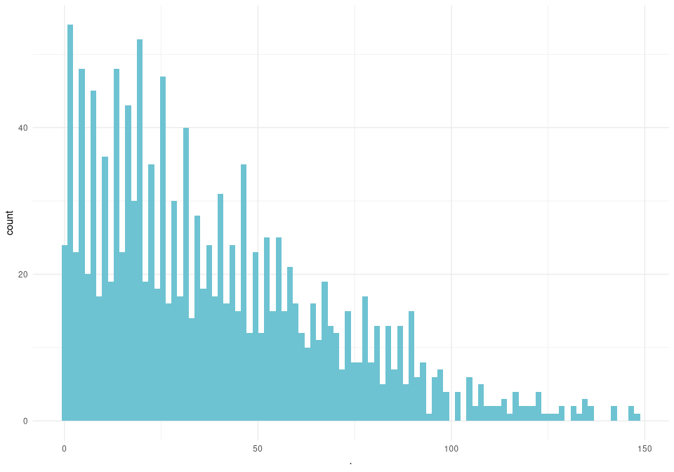
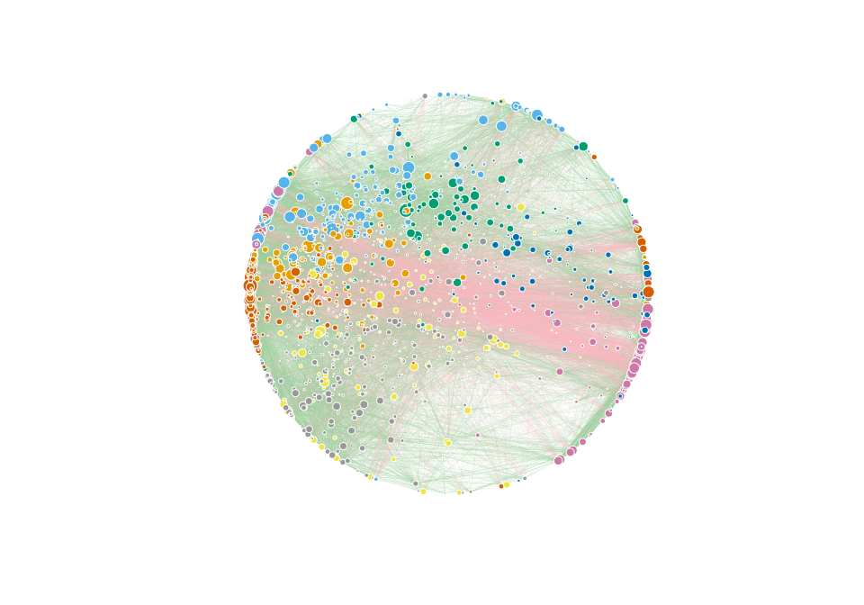
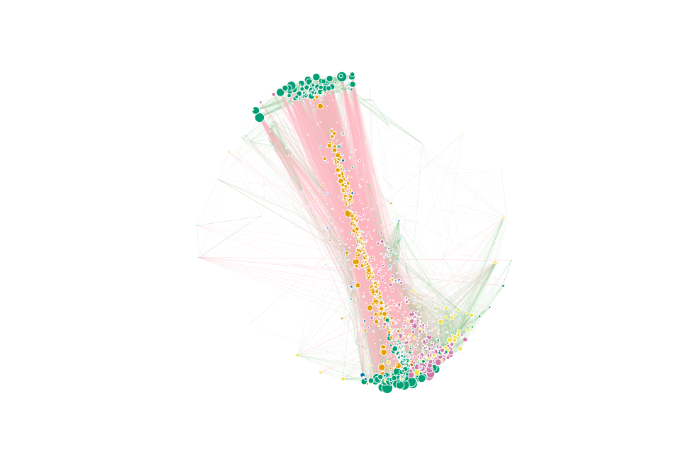
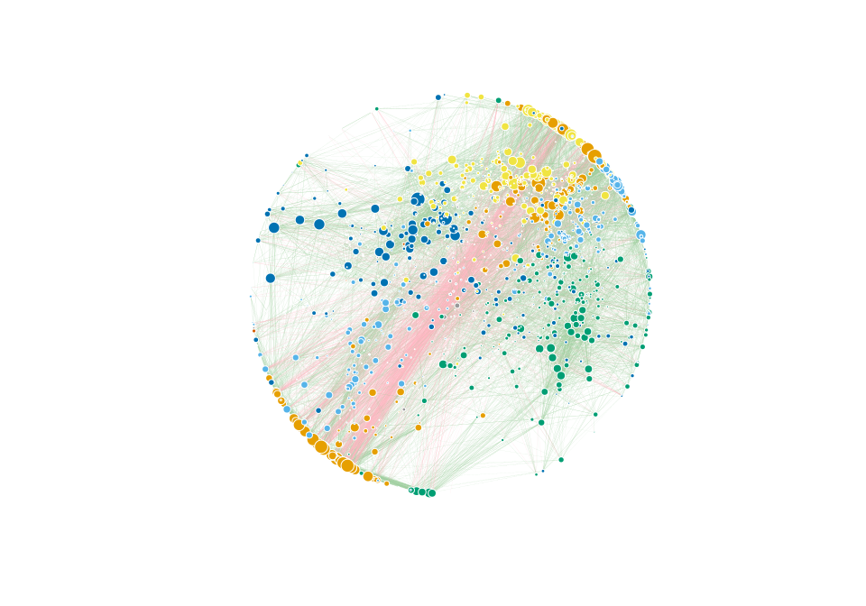
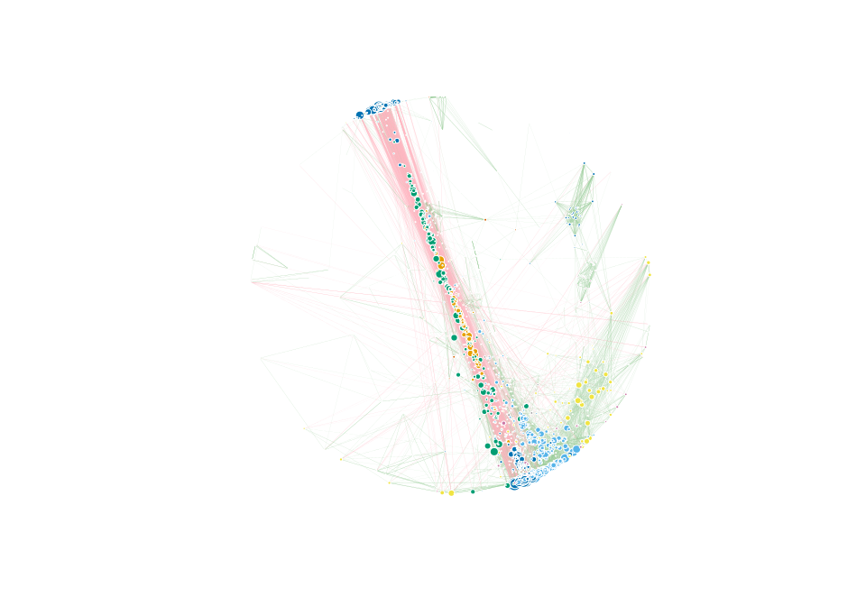

# Rankeando aristas en redes


```r
library(dplyr)
library(ggplot2)
library(pheatmap)
library(igraph)
library(vroom)
```


```r
net_inf = vroom("prs_infect.csv", col_names = TRUE)
```

```
## New names:
## * `` -> ...1
```

```
## Rows: 990528 Columns: 6
```

```
## ── Column specification ────────────────────────────────────────────────────────
## Delimiter: ","
## dbl (6): ...1, row, column, cor, p, p.adj
```

```
## 
## ℹ Use `spec()` to retrieve the full column specification for this data.
## ℹ Specify the column types or set `show_col_types = FALSE` to quiet this message.
```

```r
net_inf = net_inf[,-1]
head(net_inf)
```

```
## # A tibble: 6 × 5
##      row column      cor           p     p.adj
##    <dbl>  <dbl>    <dbl>       <dbl>     <dbl>
## 1 198059 985239 0.480    0.000000332 0.0000274
## 2 198059 840914 0.212    0.0321      0.160    
## 3 985239 840914 0.0657   0.512       0.729    
## 4 198059 174924 0.000205 0.998       0.999    
## 5 985239 174924 0.0878   0.380       0.625    
## 6 840914 174924 0.0970   0.332       0.583
```

```r
net_sld = vroom("prs_salud.csv", col_names = T)
```

```
## New names:
## * `` -> ...1
```

```
## Rows: 1076778 Columns: 6
```

```
## ── Column specification ────────────────────────────────────────────────────────
## Delimiter: ","
## dbl (6): ...1, row, column, cor, p, p.adj
```

```
## 
## ℹ Use `spec()` to retrieve the full column specification for this data.
## ℹ Specify the column types or set `show_col_types = FALSE` to quiet this message.
```

```r
net_sld = net_sld[-1]
head(net_sld)
```

```
## # A tibble: 6 × 5
##      row column      cor        p         p.adj
##    <dbl>  <dbl>    <dbl>    <dbl>         <dbl>
## 1 198059 985239  0.351   2.24e-11 0.00000000211
## 2 198059 840914  0.0547  3.13e- 1 0.532        
## 3 985239 840914  0.00175 9.74e- 1 0.988        
## 4 198059 174924  0.0443  4.13e- 1 0.626        
## 5 985239 174924  0.120   2.60e- 2 0.107        
## 6 840914 174924 -0.0650  2.30e- 1 0.442
```


```r
net_inf_fdr = filter(net_inf, net_inf$p.adj < 0.01)
net_inf_fdr2 = filter(net_inf, net_inf$p.adj < 0.001)
```


Podemos usar el número de aristas de la red de infectados como punto de corte para la red de saludables, que manera que tengamos el mismo número de aristas en ambas redes


```r
net_sld_ord = net_sld[order(-abs(net_sld$cor)),]

net_sld_rank = net_sld_ord[1:55857, 1:5]
net_sld_rank2 = net_sld_ord[1:27747, 1:5]

# Checamos los valores de p que tienen cada interacción rankeada

max(net_sld_rank$p.adj)
```

```
## [1] 0.0003949434
```

```r
max(net_sld_rank2$p.adj)
```

```
## [1] 5.327337e-06
```

```r
# En ambos casos, todas las interacciones tienen fdr < 0.001.
```


Exploramos las distribuciones de ambas redes.


```r
plot(density(net_inf_fdr$cor))
```

<!-- -->

```r
plot(density(net_inf_fdr2$cor))
```

<!-- -->

```r
plot(density(net_sld_rank$cor))
```

<!-- -->

```r
plot(density(net_sld_rank2$cor))
```

<!-- -->


## Normalización de correlación


Se normalizarán los valores de correlación de manera que el valor más chico sea 0, y el más grande 1. Para lograr esto se utilizará una normalización min-max, y se hará de manera independiente las correlaciones negativas de las positivas.


```r
minmax <- function(x, na.rm = TRUE) {
    return((x- min(x)) /(max(x)-min(x)))
}
```


Separamos correlaciones positivas y negativas


```r
inf_pos = filter(net_inf_fdr, net_inf_fdr$cor >= 0)
inf_neg = filter(net_inf_fdr, net_inf_fdr$cor < 0)

sld_pos = filter(net_sld_rank, net_sld_rank$cor >= 0)
sld_neg = filter(net_sld_rank, net_sld_rank$cor < 0)

## Para el caso p < 0.001

inf_pos2 = filter(net_inf_fdr2, net_inf_fdr2$cor >= 0)
inf_neg2 = filter(net_inf_fdr2, net_inf_fdr2$cor < 0)

sld_pos2 = filter(net_sld_rank2, net_sld_rank2$cor >= 0)
sld_neg2 = filter(net_sld_rank2, net_sld_rank2$cor < 0)
```


Normalizamos las correlaciones y unimos los data frames


```r
inf_pos$norm = minmax(inf_pos$cor)
inf_neg$norm = minmax(abs(inf_neg$cor)) * -1

sld_pos$norm = minmax(sld_pos$cor)
sld_neg$norm = minmax(abs(sld_neg$cor)) * -1


## Para p < 0.001

inf_pos2$norm = minmax(inf_pos2$cor)
inf_neg2$norm = minmax(abs(inf_neg2$cor)) * -1

sld_pos2$norm = minmax(sld_pos2$cor)
sld_neg2$norm = minmax(abs(sld_neg2$cor)) * -1

# Unimos los Data frames

net_inf_norm = rbind.data.frame(inf_pos, inf_neg)
net_sld_norm = rbind.data.frame(sld_pos, sld_neg)

net_inf_norm2 = rbind.data.frame(inf_pos2, inf_neg2)
net_sld_norm2 = rbind.data.frame(sld_pos2, sld_neg2)
```


Checamos density plots de las nuevas redes.


```r
plot(density(net_inf_norm$norm))
```

<!-- -->

```r
plot(density(net_sld_norm$norm))
```

<!-- -->


El siguiente paso es crear el objeto de *igraph* y corregir para nodos borrados durante los pasos de filtrado de correlación y rankeo.


```r
g_inf = graph_from_data_frame(net_inf_norm, directed = F)
g_sld = graph_from_data_frame(net_sld_norm, directed = F)

v_inf = V(g_inf)$name
v_sld = V(g_sld)$name

g_cominf = graph_from_data_frame(net_inf, directed = F)
g_comsld = graph_from_data_frame(net_sld, directed = F)

v_cominf = V(g_cominf)$name
v_comsld = V(g_comsld)$name

"%ni%" <- Negate("%in%")

v_missinf = subset(v_cominf, v_cominf %ni% v_inf) 
v_misssld = subset(v_comsld, v_comsld %ni% v_sld) 


g_inf_com = g_inf + add_vertices(g_inf, length(v_missinf), attr=list(name=v_missinf))
g_sld_com = g_sld + add_vertices(g_sld, length(v_misssld), attr = list(name=v_misssld))
```


# Distribución del grado y comparando el rankeo del nodos según el grado


Checamos cómo se distribuye el grado del nodo en ambas condiciones.


```r
deg_inf = degree(g_inf_com) %>% as.data.frame()
deg_sld = degree(g_sld_com) %>% as.data.frame()


ggplot(deg_inf) +
 aes(x = .) +
 geom_histogram(bins = 100L, fill = "#6EC3D2") +
 theme_minimal()
```

<!-- -->

```r
ggplot(deg_sld) +
 aes(x = .) +
 geom_histogram(bins = 100L, fill = "pink") +
 theme_minimal()
```

<!-- -->


Repetimos los mismos pasos para la red p < 0.001


```r
g_inf2 = graph_from_data_frame(net_inf_norm2, directed = F)
g_sld2 = graph_from_data_frame(net_sld_norm2, directed = F)

v_inf2 = V(g_inf)$name
v_sld2 = V(g_sld)$name


v_missinf2 = subset(v_cominf, v_cominf %ni% v_inf2) 
v_misssld2 = subset(v_comsld, v_comsld %ni% v_sld2) 


g_inf_com2 = g_inf2 + add_vertices(g_inf2, length(v_missinf2), attr=list(name=v_missinf2))
g_sld_com2 = g_sld2 + add_vertices(g_sld2, length(v_misssld2), attr = list(name=v_misssld2))
```


```r
deg_inf2 = degree(g_inf_com2) %>% as.data.frame()
deg_sld2 = degree(g_sld_com2) %>% as.data.frame()


ggplot(deg_inf2) +
 aes(x = .) +
 geom_histogram(bins = 100L, fill = "#6EC3D2") +
 theme_minimal()
```

<!-- -->

```r
ggplot(deg_sld2) +
 aes(x = .) +
 geom_histogram(bins = 100L, fill = "pink") +
 theme_minimal()
```

<!-- -->


```r
#Rankeamos grado para infectados

V(g_inf_com)$degree = degree(g_inf_com)
df_deg_inf = cbind.data.frame(V(g_inf_com)$name, V(g_inf_com)$degree)
deg_inf_ord = df_deg_inf[order(-df_deg_inf$`V(g_inf_com)$degree`),]


#Rankeamos grado para saludables
V(g_sld_com)$degree = degree(g_sld_com)

df_deg_sld = cbind.data.frame(V(g_sld_com)$name, V(g_sld_com)$degree)
deg_sld_ord = df_deg_sld[order(-df_deg_sld$`V(g_sld_com)$degree`),]


head(deg_sld_ord)
```

```
##     V(g_sld_com)$name V(g_sld_com)$degree
## 202            295485                 324
## 283            324214                 324
## 183            528652                 315
## 347            531888                 315
## 211            369014                 303
## 144            287978                 299
```

```r
head(deg_inf_ord)
```

```
##     V(g_inf_com)$name V(g_inf_com)$degree
## 637            519398                 256
## 343            367889                 250
## 30             591285                 243
## 340            575844                 243
## 294            345801                 233
## 349            369379                 231
```

Definimos una función para calcular el índice de Jaccard


```r
jaccard = function(A,B) {
  
  int = length(intersect(A,B))
  uni = length(union(A,B))
  jac = int/uni
  return(jac)
}
```


```r
#JI para todos los nodos de la red más pequeña

jaccard(deg_sld_ord$`V(g_sld_com)$name`[1:1408], 
        deg_inf_ord$`V(g_inf_com)$name`[1:1408])
```

```
## [1] 0.7490683
```

```r
#JI para top 10 nodos
jaccard(deg_sld_ord$`V(g_sld_com)$name`[1:10], 
        deg_inf_ord$`V(g_inf_com)$name`[1:10])
```

```
## [1] 0.05263158
```

```r
#JI para top 20 nodos
jaccard(deg_sld_ord$`V(g_sld_com)$name`[1:20], 
        deg_inf_ord$`V(g_inf_com)$name`[1:20])
```

```
## [1] 0.05263158
```

```r
#JI para top 50 nodos
jaccard(deg_sld_ord$`V(g_sld_com)$name`[1:50], 
        deg_inf_ord$`V(g_inf_com)$name`[1:50])
```

```
## [1] 0.1904762
```

```r
#JI para top 100 nodos
jaccard(deg_sld_ord$`V(g_sld_com)$name`[1:100], 
        deg_inf_ord$`V(g_inf_com)$name`[1:100])
```

```
## [1] 0.1904762
```

```r
#JI para top 500 nodos
jaccard(deg_sld_ord$`V(g_sld_com)$name`[1:500], 
        deg_inf_ord$`V(g_inf_com)$name`[1:500])
```

```
## [1] 0.3297872
```


## Netviz


```r
com_inf = cluster_louvain(g_inf_com, weights = abs(E(g_inf_com)$norm_1))
V(g_inf_com)$community = com_inf$membership
V(g_inf_com)$label = NA
V(g_inf_com)$size = degree(g_inf_com, v=V(g_inf_com)) %>% minmax() *7 %>% +.2
V(g_inf_com)$frame.color = "white"
V(g_inf_com)$color = V(g_inf_com)$community  #"lightblue3"

E(g_inf_com)$width = abs(E(g_inf_com)$norm_1) / 2.5
E(g_inf_com)$color = ifelse(E(g_inf_com)$norm_1 >0, "darkseagreen3","lightpink")
E(g_inf_com)$curved = 0

l <- layout_with_fr(g_inf_com, niter = 10000, weights = E(g_inf_com)$norm_1)


plot(g_inf_com, rescale = T, layout = l*1)
```

<!-- -->


```r
com_sld = cluster_louvain(g_sld_com, weights = abs(E(g_sld_com)$norm_1))
V(g_sld_com)$community = com_sld$membership
V(g_sld_com)$label = NA
V(g_sld_com)$size = degree(g_sld_com, v=V(g_sld_com)) %>% minmax() *7 %>% +.2
V(g_sld_com)$frame.color = "white"
V(g_sld_com)$color =  V(g_sld_com)$community #"lightblue3"
#
E(g_sld_com)$width = abs(E(g_sld_com)$norm_1) / 2.5
E(g_sld_com)$color = ifelse(E(g_sld_com)$norm_1 >0, "darkseagreen3","lightpink")
E(g_sld_com)$curved = 0

ls <- layout_with_fr(g_sld_com, niter = 50 ,weights = E(g_sld_com)$norm_1)


plot(g_sld_com, rescale = T, layout = ls)
```

<!-- -->


```r
com_inf2 = cluster_louvain(g_inf_com2, weights = abs(E(g_inf_com2)$norm_1))
V(g_inf_com2)$community = com_inf2$membership
V(g_inf_com2)$label = NA
V(g_inf_com2)$size = degree(g_inf_com2, v=V(g_inf_com2)) %>% minmax() *7 %>% +.2
V(g_inf_com2)$frame.color = "white"
V(g_inf_com2)$color = V(g_inf_com2)$community  #"lightblue3"

E(g_inf_com2)$width = abs(E(g_inf_com2)$norm_1) / 2.5
E(g_inf_com2)$color = ifelse(E(g_inf_com2)$norm_1 >0, "darkseagreen3","lightpink")
E(g_inf_com2)$curved = 0

l2 <- layout_with_fr(g_inf_com2, niter = 10000, weights = E(g_inf_com2)$norm_1)


plot(g_inf_com2, rescale = T, layout = l2)
```

<!-- -->


```r
com_sld2 = cluster_louvain(g_sld_com2, weights = abs(E(g_sld_com2)$norm_1))
V(g_sld_com2)$community = com_sld2$membership
V(g_sld_com2)$label = NA
V(g_sld_com2)$size = degree(g_sld_com2, v=V(g_sld_com2)) %>% minmax() *7 %>% +.2
V(g_sld_com2)$frame.color = "white"
V(g_sld_com2)$color =  V(g_sld_com2)$community #"lightblue3"
#
E(g_sld_com2)$width = abs(E(g_sld_com2)$norm_1) / 2.5
E(g_sld_com2)$color = ifelse(E(g_sld_com2)$norm_1 >0, "darkseagreen3","lightpink")
E(g_sld_com2)$curved = 0

ls2 <- layout_with_fr(g_sld_com2, niter =  50 ,weights = E(g_sld_com2)$norm_1)


plot(g_sld_com2, rescale = T, layout = ls2)
```

<!-- -->


